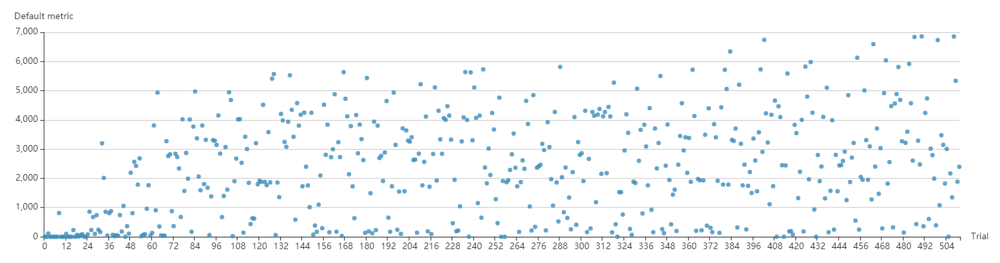

# NNI 上调优张量算子

## 概述

深度神经网络（DNN）的大量应用，催生了对从云服务器到嵌入式设备等不同硬件平台上的训练和推理的需求。 此外，还有深度神经网络上的计算图优化问题，如张量算子融合会引入新的张量算子。 然而，人工通过特定硬件库来优化张量算子，不能很好的支持新硬件平台和新算子，存在一定的局限性。因此，在大规模部署和深度学习技术的实际场景中，不同平台上的自动化的张量算子优化变得非常重要。

张量算子优化的本质，是一个组合优化问题。 目标函数是张量算子在某个硬件平台上的性能，通过调整超参（如，如何切片矩阵，展开循环）实现该平台上的最佳性能。 与许多典型的此类问题（如旅行推销员问题）不同，张量算子优化的目标函数是黑盒，采样成本较高。 必须用特定的配置编译设备代码，并在真实的硬件上运行，以获得相应的性能指标。 因此，理想的张量算子优化方法应该在尽可能少的样本下找到最佳的配置。

代价昂贵的目标函数使得用传统的组合优化方法，如模拟退火和进化算法求解张量算子优化问题几乎不可能。 尽管这些算法本质上支持组合搜索空间，但它们并未考虑采样效率，因此通常需要成千上万甚至更多的样本，这在生产环境中调整张量算子时是不可接受的。 另一方面，事实证明，基于序列模型的优化（SMBO）方法可有效地优化具有连续搜索空间的黑盒函数。 然而，在使用组合搜索空间进行优化时，SMBO 方法的采样效率不及连续搜索方法，这是因为缺少关于目标函数的先验假设，例如连续搜索空间的连续性和可微性。 例如，如果可以假设具有连续搜索空间的目标函数是无限可微的，则可以使用具有径向基函数（RBF）核的高斯过程对目标函数进行建模。 这样，一个样本不仅提供了一个点上的单一值，而且还提供了目标函数在其邻域上的局部性质，甚至是全局性质，从而获得了较高的采样效率。 相比之下，用于组合优化的SMBO方法由于缺乏适当的先验假设和可以利用它们的替代模型而导致采样效率低下。

最近提出的 OpEvo 就是为了解决这个具有挑战性的问题。 它通过引入基于 q-随机游走分布的拓扑感知突变操作来利用搜索空间上的拓扑结构，有效地探索了张量算子的搜索空间。 在本例中，可以使用OpEvo调优从两个流行的神经网络（BERT和AlexNet）中选择的三种代表性张量算子。 还提供了三个比较基线：AutoTVM，G-BFS和N-A2C。 参考论文 [OpEvo: An Evolutionary Method for Tensor Operator Optimization](https://arxiv.org/abs/2006.05664) 来了解算法。

## 配置环境

此示例准备了 Dockerfile 作为 Experiment 的环境。 开始前，确保 Docker 守护进程已启动，GPU 加速驱动已正确安装。 进入示例目录 `examples/trials/systems/opevo` 并运行下列命令，从 Dockerfile 构建并实例化 Docker 映像。
```bash
# 如果使用 Nvidia GPU
make cuda-env
# 如果使用 AMD GPU
make rocm-env
```

## 运行 Experiment

这里从 BERT 和 AlexNet 中选择了三种有代表性的张量算子：**矩阵乘法**、**批处理的矩阵乘法**，以及**二维卷积**，并使用 NNI 进行调优。 所有张量算子的 `Trial` 代码都是 `/root/compiler_auto_tune_stable.py`，每个调优算法的`搜索空间`和`配置`文件都在按张量算子分类的 `/root/experiments/` 目录中。 这里的 `/root` 表示容器中的 root 目录。

在 `/root` 中运行以下命令来调优矩阵乘法：
```bash
# (N, K) x (K, M) 表示形状为 (N, K) 的矩阵乘以形状为 (K, M) 的矩阵

# (512, 1024) x (1024, 1024)
# 用 OpenEvo 调优
nnictl create --config experiments/mm/N512K1024M1024/config_opevo.yml
# 用 G-BFS 调优
nnictl create --config experiments/mm/N512K1024M1024/config_gbfs.yml
# 用 N-A2C 调优
nnictl create --config experiments/mm/N512K1024M1024/config_na2c.yml
# 用 AutoTVM 调优
OP=matmul STEP=512 N=512 M=1024 K=1024 P=NN ./run.s

# (512, 1024) x (1024, 4096)
# 用 OpenEvo 调优
nnictl create --config experiments/mm/N512K1024M4096/config_opevo.yml
# 用 G-BFS 调优
nnictl create --config experiments/mm/N512K1024M4096/config_gbfs.yml
# 用 N-A2C调优
nnictl create --config experiments/mm/N512K1024M4096/config_na2c.yml
# 用 AutoTVM 调优
OP=matmul STEP=512 N=512 M=1024 K=4096 P=NN ./run.sh

# (512, 4096) x (4096, 1024)
# 用 OpenEvo 调优
nnictl create --config experiments/mm/N512K4096M1024/config_opevo.yml
# 用 G-BFS 调优
nnictl create --config experiments/mm/N512K4096M1024/config_gbfs.yml
# 用 N-A2C调优
nnictl create --config experiments/mm/N512K4096M1024/config_na2c.yml
# 用 AutoTVM 调优
OP=matmul STEP=512 N=512 M=4096 K=1024 P=NN ./run.sh
```

在 `/root` 中运行以下命令来调优批处理矩阵乘法：
```bash
# 批处理大小为 960，形状为 (128, 128) 的矩阵，乘以批处理大小为 960，形状为 (128, 64) 的矩阵
# 用 OpEvo 调优
nnictl create --config experiments/bmm/B960N128K128M64PNN/config_opevo.yml
# 用 AutoTVM 调优
OP=batch_matmul STEP=512 B=960 N=128 K=128 M=64 P=NN ./run.sh

# 批处理大小为 960，形状为 (128, 128) 的矩阵，先转置，然后乘以批处理大小为 960，形状为 (128, 64) 的矩阵
# 用 OpEvo 调优
nnictl create --config experiments/bmm/B960N128K128M64PTN/config_opevo.yml
# 用 AutoTVM 调优
OP=batch_matmul STEP=512 B=960 N=128 K=128 M=64 P=TN ./run.sh

# 批处理大小为 960，形状为 (128, 128) 的矩阵，先转置，然后右乘批处理大小为 960，形状为 (128, 64) 的矩阵
# 用 OpEvo 调优
nnictl create --config experiments/bmm/B960N128K64M128PNT/config_opevo.yml
# 用 AutoTVM 调优
OP=batch_matmul STEP=512 B=960 N=128 K=64 M=128 P=NT ./run.sh
```

在 `/root` 中运行以下命令来调优二维卷积：
```bash
# 形状为（512，3，227，227）的图像张量与形状为（64，3，11，11）的内核张量以步幅 4 和填充 0 卷积
# 用 OpEvo 调优
nnictl create --config experiments/conv/N512C3HW227F64K11ST4PD0/config_opevo.yml
# 用 AutoTVM 调优
OP=convfwd_direct STEP=512 N=512 C=3 H=227 W=227 F=64 K=11 ST=4 PD=0 ./run.sh

# 形状为（512，64，27，27）的图像张量和形状为（192，64，5，5）的内核张量以步幅 1 和填充 2 卷积
# 用 OpEvo 调优
nnictl create --config experiments/conv/N512C64HW27F192K5ST1PD2/config_opevo.yml
# 用 AutoTVM 调优
OP=convfwd_direct STEP=512 N=512 C=64 H=27 W=27 F=192 K=5 ST=1 PD=2 ./run.sh
```

请注意，G-BFS 和 N-A2C 这两种方法是专为优化行和列为2的幂的矩阵相乘的平铺（tiling）策略而设计的，所以他们不能够兼容其他类型的搜索空间，因此不能够用来优化批量矩阵乘和2维卷积这两种张量算子。 这里，AutoTVM是由作者在 TVM 项目中实现的，因此调优结果打印在屏幕上，而不是报告给 NNI 管理器。 容器的端口 8080 绑定到主机的同一端口，因此可以通过 `host_ip_addr:8080` 访问NNI Web 界面，并监视调优过程，如下面的屏幕截图所示。



## 引用 OpEvo

如果认为 OpEvo 有帮助，请考虑如下引用论文：
```
@misc{gao2020opevo,
    title={OpEvo: An Evolutionary Method for Tensor Operator Optimization},
    author={Xiaotian Gao and Cui Wei and Lintao Zhang and Mao Yang},
    year={2020},
    eprint={2006.05664},
    archivePrefix={arXiv},
    primaryClass={cs.LG}
}
```
