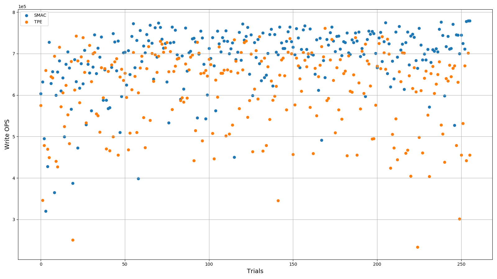

# 在 NNI 上调优 RocksDB

## 概述

[RocksDB](https://github.com/facebook/rocksdb) 是流行的高性能、嵌入式的生产级别的键值数据库，它在 Facebook，Yahoo!，和 LinkedIn 等各种规模的网站上使用。 这是 Facebook 的 [LevelDB](https://github.com/google/leveldb) 分支，为多 CPU，快速存储（如 SSD）的输入输出进行了优化。

RocksDB 的性能表现非常依赖于调优操作。 但由于其底层技术较复杂，可配置参数非常多，很难获得较好的配置。 NNI 可帮助解决此问题。 NNI 支持多种调优算法来为 RocksDB 搜索最好的配置，并支持本机、远程服务器和云服务等多种环境。

本示例展示了如何使用 NNI，通过评测工具 `db_bench` 来找到 `fillrandom` 基准的最佳配置，此工具是 RocksDB 官方提供的评测工具。 在运行示例前，需要检查 NNI 已安装，

db_bench</code> 已经加入到了 `PATH` 中。 参考[这里](../Tutorial/QuickStart.md)，了解如何安装并准备 NNI 环境，参考[这里](https://github.com/facebook/rocksdb/blob/master/INSTALL.md)来编译 RocksDB 以及 `db_bench`。</p> 

此简单脚本 [`db_bench_installation.sh`](../../../examples/trials/systems/rocksdb-fillrandom/db_bench_installation.sh) 可帮助编译并在 Ubuntu 上安装 `db_bench` 及其依赖包。 可遵循相同的过程在其它系统中安装 RocksDB。

*代码目录：[`example/trials/systems/rocksdb-fillrandom`](../../../examples/trials/systems/rocksdb-fillrandom)*


## Experiment 设置

在 NNI 上配置调优的 Experiment 主要有三个步骤。 使用 `json` 文件定义搜索空间，编写评测代码，将配置传入 NNI 管理器来启动 Experiment。


### 搜索空间

为简单起见，此示例仅调优三个参数，`write_buffer_size`, `min_write_buffer_num` 以及 `level0_file_num_compaction_trigger`，场景为测试随机写入 16M 数据的每秒写操作数（OPS），其 Key 为 20 字节，值为 100 字节。 `write_buffer_size` 设置单个内存表的大小。 一旦内存表超过此大小，会被标记为不可变，并创建新内存表。 `min_write_buffer_num` 是要合并写入存储的最小内存表数量。 一旦 Level 0 的文件数量达到了 `level0_file_num_compaction_trigger`，就会触发 Level 0 到 Level 1 的压缩。

此示例中，下列 `search_space.json` 文件指定了搜索空间。 搜索空间的详细说明参考[这里](../Tutorial/SearchSpaceSpec.md)。


```json
{
    "write_buffer_size": {
        "_type": "quniform",
        "_value": [2097152, 16777216, 1048576]
    },
    "min_write_buffer_number_to_merge": {
        "_type": "quniform",
        "_value": [2, 16, 1]
    },
    "level0_file_num_compaction_trigger": {
        "_type": "quniform",
        "_value": [2, 16, 1]
    }
}
```


*代码目录：[`example/trials/systems/rocksdb-fillrandom/search_space.json`](../../../examples/trials/systems/rocksdb-fillrandom/search_space.json)*


### 评测代码

评测代码从 NNI 管理器接收配置，并返回相应的基准测试结果。 下列 NNI API 用于相应的操作。 In this example, writing operations per second (OPS) is used as a performance metric. Please refer to [here](Trials.md) for detailed information.

* Use `nni.get_next_parameter()` to get next system configuration.
* Use `nni.report_final_result(metric)` to report the benchmark result.

*code directory: [`example/trials/systems/rocksdb-fillrandom/main.py`](../../../examples/trials/systems/rocksdb-fillrandom/main.py)*


### Config file

One could start a NNI experiment with a config file. A config file for NNI is a `yaml` file usually including experiment settings (`trialConcurrency`, `maxExecDuration`, `maxTrialNum`, `trial gpuNum`, etc.), platform settings (`trainingServicePlatform`, etc.), path settings (`searchSpacePath`, `trial codeDir`, etc.) and tuner settings (`tuner`, `tuner optimize_mode`, etc.). Please refer to [here](../Tutorial/QuickStart.md) for more information.

Here is an example of tuning RocksDB with SMAC algorithm:

*code directory: [`example/trials/systems/rocksdb-fillrandom/config_smac.yml`](../../../examples/trials/systems/rocksdb-fillrandom/config_smac.yml)*

Here is an example of tuning RocksDB with TPE algorithm:

*code directory: [`example/trials/systems/rocksdb-fillrandom/config_tpe.yml`](../../../examples/trials/systems/rocksdb-fillrandom/config_tpe.yml)*

Other tuners can be easily adopted in the same way. Please refer to [here](../Tuner/BuiltinTuner.md) for more information.

Finally, we could enter the example folder and start the experiment using following commands:


```bash
# tuning RocksDB with SMAC tuner
nnictl create --config ./config_smac.yml
# tuning RocksDB with TPE tuner
nnictl create --config ./config_tpe.yml
```


## Experiment results

We ran these two examples on the same machine with following details:

* 16 * Intel(R) Xeon(R) CPU E5-2650 v2 @ 2.60GHz
* 465 GB of rotational hard drive with ext4 file system
* 128 GB of RAM
* Kernel version: 4.15.0-58-generic
* NNI version: v1.0-37-g1bd24577
* RocksDB version: 6.4
* RocksDB DEBUG_LEVEL: 0

The detailed experiment results are shown in the below figure. Horizontal axis is sequential order of trials. Vertical axis is the metric, write OPS in this example. Blue dots represent trials for tuning RocksDB with SMAC tuner, and orange dots stand for trials for tuning RocksDB with TPE tuner. 



Following table lists the best trials and corresponding parameters and metric obtained by the two tuners. Unsurprisingly, both of them found the same optimal configuration for `fillrandom` benchmark.

| Tuner | Best trial | Best OPS | write_buffer_size | min_write_buffer_number_to_merge | level0_file_num_compaction_trigger |
|:-----:|:----------:|:--------:|:-------------------:|:------------------------------------:|:--------------------------------------:|
| SMAC  |    255     |  779289  |       2097152       |                 7.0                  |                  7.0                   |
|  TPE  |    169     |  761456  |       2097152       |                 7.0                  |                  7.0                   |
