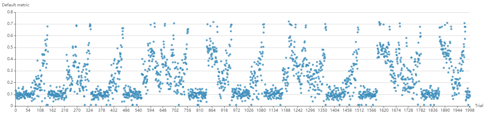
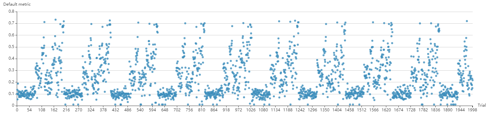

NNI 中使用 Hyperband
================================

1. 介绍
---------------

`Hyperband <https://arxiv.org/pdf/1603.06560.pdf>`__ 是一种流行的自动机器学习算法。 Hyperband 的基本思想是对配置分组，每组有 ``n`` 个随机生成的超参配置，每个配置使用 ``r`` 次资源（如，epoch 数量，批处理数量等）。 当 ``n`` 个配置完成后，会选择最好的 ``n/eta`` 个配置，并增加 ``r*eta`` 次使用的资源。 最后，会选择出的最好配置。

2. 实现并行
---------------------------------------

首先，此示例是基于 MsgDispatcherBase 来实现的自动机器学习算法，而不是基于 Tuner 和 Assessor。 这种实现方法下，Hyperband 集成了 Tuner 和 Assessor 两者的功能，因而将它叫做 Advisor。

其次，本实现完全利用了 Hyperband 内部的并行性。 具体来说，下一个分组不会严格的在当前分组结束后再运行。 只要有资源，就可以开始运行新的分组。 如果要使用完全并行模式，请将 ``exec_mode`` 设置为 ``parallelism（并行）``。 

或者，根据原始算法将 ``exec_mode`` 设置为 ``serial（串行）``。 如果是 ``串行`` ， Tuner 只会在当前分组完成后启动新的分组。

``并行`` 模式可能会导致多个未完成的分组，而 ``串行`` 模式下最多只有一个未完成的分组。 ``并行`` 模式的优点是充分利用资源，成倍减少实验时间。 下面两张图片是使用 `nas-bench-201 <../NAS/Benchmarks.rst>`__ 快速验证的结果，上面的图片是 ``并行`` 模式，下面的图片是 ``串行`` 模式。

如果你想复现这些结果，请参考示例 ``examples/trials/benchmarking/``。

3. 用法
--------

要使用 Hyperband，需要在 Experiment 的 YAML 配置文件进行如下改动。

.. code-block:: bash

   advisor:
     #choice: Hyperband
     builtinAdvisorName: Hyperband
     classArgs:
       #R: Trial 的最大分组
       R: 100
       # eta: 丢弃的 Trial 的比例
       eta: 3
       #choice: 最大、最小
       optimize_mode: maximize
       #choice: 串行、并行
       exec_mode: parallelism

注意，一旦使用了 Advisor，就不能在配置文件中添加 Tuner 和 Assessor。 使用 Hyperband 时，Trial 代码收到的超参（如键值对）中，会多一个用户定义的 ``TRIAL_BUDGET``。 **使用 ``TRIAL_BUDGET``， Trial 可以控制运行的时间。**

对于 Trial 代码中 ``report_intermediate_result(metric)`` 和 ``report_final_result(metric)``，**\ ``指标`` 应该是数值，或者用一个 dict，并保证其中有键值为 ``default`` 的项目，其值也为数值型**。 这是需要进行最大化或者最小化优化的数值，如精度或者损失度。

``R`` 和 ``eta`` 是 Hyperband 中可以改动的参数。 ``R`` 表示可以分配给 Trial 的最大资源。 这里，资源可以代表 epoch 或 批处理数量。 ``TRIAL_BUDGET`` 应该被尝试代码用来控制运行的次数。 参考示例 ``examples/trials/mnist-advisor/`` ，了解详细信息。

``eta`` 表示 ``n/eta`` 个配置中的 ``n/eta`` 个配置会留存下来，并用更多的资源来运行。

下面是 ``R=81`` 且 ``eta=3`` 时的样例：

.. list-table::
   :header-rows: 1
   :widths: auto

   * -
     - s=4
     - s=3
     - s=2
     - s=1
     - s=0
   * - i
     - n r
     - n r
     - n r
     - n r
     - n r
   * - 0
     - 81 1
     - 27 3
     - 9 9
     - 6 27
     - 5 81
   * - 1
     - 27 3
     - 9 9
     - 3 27
     - 2 81
     -
   * - 2
     - 9 9
     - 3 27
     - 1 81
     -
     -
   * - 3
     - 3 27
     - 1 81
     -
     -
     -
   * - 4
     - 1 81
     -
     -
     -
     -

``s`` 表示分组， ``n`` 表示生成的配置数量，相应的 ``r`` 表示配置使用多少资源来运行。 ``i`` 表示轮数，如分组 4 有 5 轮，分组 3 有 4 轮。

关于如何实现 Trial 代码，参考 ``examples/trials/mnist-hyperband/`` 中的说明。

4. 未来的改进
----------------------

当前实现的 Hyperband 算法可以通过改进支持的提前终止算法来提高，因为最好的 ``n/eta`` 个配置并不一定都表现很好。 不好的配置应该更早的终止。

在当前实现中，遵循了 `此论文 <https://arxiv.org/pdf/1603.06560.pdf>`__ 的设计，配置都是随机生成的。 要进一步提升，配置生成过程可以利用更高级的算法。
