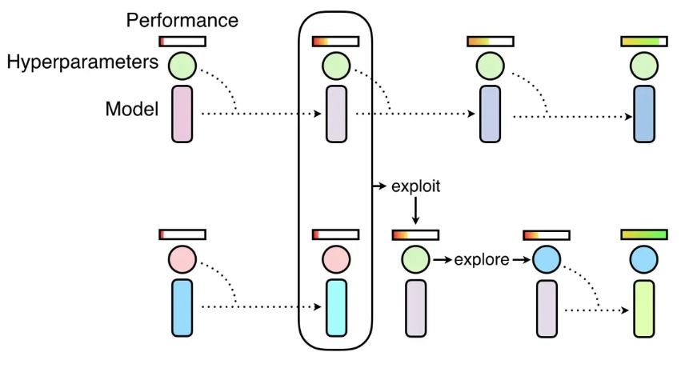

NNI 中的 PBTTuner
===

## PBTTuner

Population Based Training (PBT，基于种群的训练) 来自于 [Population Based Training of Neural Networks](https://arxiv.org/abs/1711.09846v1)。 它是一种简单的异步优化算法，在固定的计算资源下，它能有效的联合优化一组模型及其超参来最大化性能。 重要的是，PBT 探索的是超参设置的规划，而不是通过整个训练过程中，来试图找到某个固定的参数配置。



PBTTuner 使用多个 Trial 来初始化种群 (即，`population_size`)。 上图中有四步，每个 Trial 只运行一步。 每步运行的时长由 Trial 代码控制，如一个 Epoch。 当 Trial 开始时，会加载 PBTTuner 指定的检查点，并继续运行一步，然后将检查点保存到PBTTuner 指定的目录中，并退出。 种群中的 Trial 会同步的运行这些步骤，也就是说，所有 Trial 都完成了第 `i` 步后，`(i+1)` 步才能开始。 PBT 的挖掘（Exploitation）和探索（Exploration）是两个连续的步骤。

### 提供检查点目录

Since some trials need to load other trial's checkpoint, users should provide a directory (i.e., `all_checkpoint_dir`) which is accessible by every trial. It is easy for local mode, users could directly use the default directory or specify any directory on the local machine. For other training services, users should follow [the document of those training services](../TrainingService/SupportTrainingService.md) to provide a directory in a shared storage, such as NFS, Azure storage.

### Modify your trial code

Before running a step, a trial needs to load a checkpoint, the checkpoint directory is specified in hyper-parameter configuration generated by PBTTuner, i.e., `params['load_checkpoint_dir']`. Similarly, the directory for saving checkpoint is also included in the configuration, i.e., `params['save_checkpoint_dir']`. Here, `all_checkpoint_dir` is base folder of `load_checkpoint_dir` and `save_checkpoint_dir` whose format is `all_checkpoint_dir/<population-id>/<step>`.

```python
params = nni.get_next_parameter()
# the path of the checkpoint to load
load_path = os.path.join(params['load_checkpoint_dir'], 'model.pth')
# load checkpoint from `load_path`
...
# run one step
...
# the path for saving a checkpoint
save_path = os.path.join(params['save_checkpoint_dir'], 'model.pth')
# save checkpoint to `save_path`
...
```

The complete example code can be found [here](https://github.com/microsoft/nni/tree/master/examples/trials/mnist-pbt-tuner-pytorch).

### Experiment config

Below is an exmaple of PBTTuner configuration in experiment config file. **Note that Assessor is not allowed if PBTTuner is used.**

```yaml
# config.yml
tuner:
  builtinTunerName: PBTTuner
  classArgs:
    optimize_mode: maximize
    all_checkpoint_dir: /the/path/to/store/checkpoints
    population_size: 10
```

### Limitation

Importing data has not been supported yet.