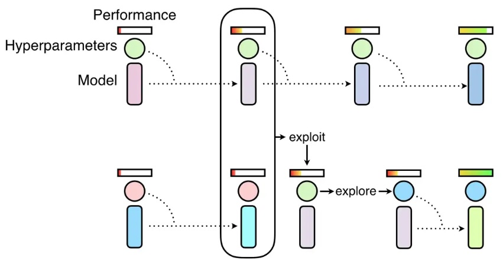

NNI 中的 PBTTuner
================================

PBTTuner
--------

Population Based Training (PBT，基于种群的训练) 来自于论文 `Population Based Training of Neural Networks <https://arxiv.org/abs/1711.09846v1>`__。 它是一种简单的异步优化算法，在固定的计算资源下，它能有效的联合优化一组模型及其超参来最大化性能。 重要的是，PBT 探索的是超参设置的规划，而不是通过整个训练过程中，来试图找到某个固定的参数配置。 

PBTTuner 使用多个 Trial 来初始化种群 (即，``population_size``)。 上图中有四步，每个 Trial 只运行一步。 每步运行的时长由 Trial 代码控制，如一个 Epoch。 当 Trial 开始时，会加载 PBTTuner 指定的检查点，并继续运行一步，然后将检查点保存到PBTTuner 指定的目录中，并退出。 种群中的 Trial 会同步的运行这些步骤，也就是说，所有 Trial 都完成了第 ``i`` 步后，``(i+1)`` 步才能开始。 PBT 的挖掘（Exploitation）和探索（Exploration）是两个连续的步骤。

提供检查点目录
^^^^^^^^^^^^^^^^^^^^^^^^^^^^

为了让 Trial 读取其它 Trial 的检查点，需要提供能够被所有 Trial 访问到的目录 (即，``all_checkpoint_dir`` )。 本机模式下非常容易，直接使用默认目录，或指定本机的任意目录均可。 对于其他训练平台，需要根据 `训练平台文档 <../TrainingService/Overview.rst>`__ 来提供能共享的目录，如 NFS, Azure 存储。

修改 Trial 代码
^^^^^^^^^^^^^^^^^^^^^^

在运行步骤之前，Trial 需要读取检查点，检查点目录由 PBTTuner 的超参配置来决定，即 ``params['load_checkpoint_dir']``。 同样，保存检查点的目录也包含在配置中，即，``params['save_checkpoint_dir']``。 在这里，``all_checkpoint_dir`` 是 ``load_checkpoint_dir`` 和 ``save_checkpoint_dir``的根目录，格式为 ``all_checkpoint_dir/<population-id>/<step>``。

.. code-block:: python

   params = nni.get_next_parameter()
   # 读取检查点的路径
   load_path = os.path.join(params['load_checkpoint_dir'], 'model.pth')
   # 从 `load_path` 中读取检查点
   ...
   # 运行一步
   ...
   # 保存检查点的路径
   save_path = os.path.join(params['save_checkpoint_dir'], 'model.pth')
   # 将检查点保存到 `save_path`
   ...

完整的示例代码参考 :githublink:`这里 <examples/trials/mnist-pbt-tuner-pytorch>`。

Experiment 配置
^^^^^^^^^^^^^^^^^

以下是 PBTTuner 在 Experiment 配置文件中的示例。 **注意，如果使用了 PBTTuner，就不能使用 Assessor。**

.. code-block:: yaml

   # config.yml
   tuner:
     builtinTunerName: PBTTuner
     classArgs:
       optimize_mode: maximize
       all_checkpoint_dir: /the/path/to/store/checkpoints
       population_size: 10
