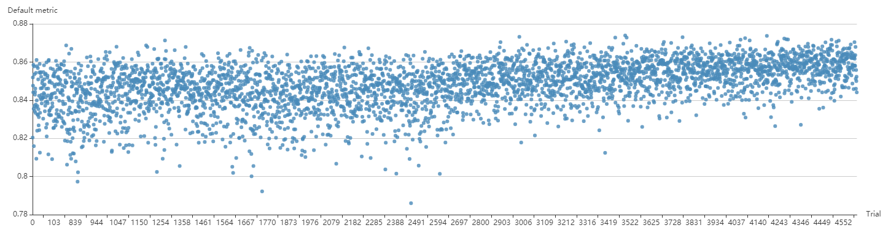

# NNI 中的 PPO Tuner

## PPOTuner

This is a tuner geared for NNI's Neural Architecture Search (NAS) interface. 它使用了 [ppo 算法](https://arxiv.org/abs/1707.06347)。 此实现继承了 [OpenAI 的 ppo2 实现](https://github.com/openai/baselines/tree/master/baselines/ppo2)的主要逻辑，并为 NAS 场景做了适配。

它能成功调优 [mnist-nas 示例](https://github.com/microsoft/nni/tree/master/examples/trials/mnist-nas)，结果如下：

我们也使用 NAS 接口和 PPO Tuner 调优了[ ENAS 论文中为图片分类所做的宏分类](https://github.com/microsoft/nni/tree/master/examples/trials/nas_cifar10)（Trial 中 Epoch 限定为 8）。 Here is Figure 7 from the [enas paper](https://arxiv.org/pdf/1802.03268.pdf) to show what the search space looks like

The figure above was the chosen architecture. Each square is a layer whose operation was chosen from 6 options. Each dashed line is a skip connection, each square layer can choose 0 or 1 skip connections, getting the output from a previous layer. **Note that**, in original macro search space, each square layer could choose any number of skip connections, while in our implementation, it is only allowed to choose 0 or 1.

The results are shown in figure below (see the experimenal config [here](https://github.com/microsoft/nni/blob/master/examples/trials/nas_cifar10/config_ppo.yml):

