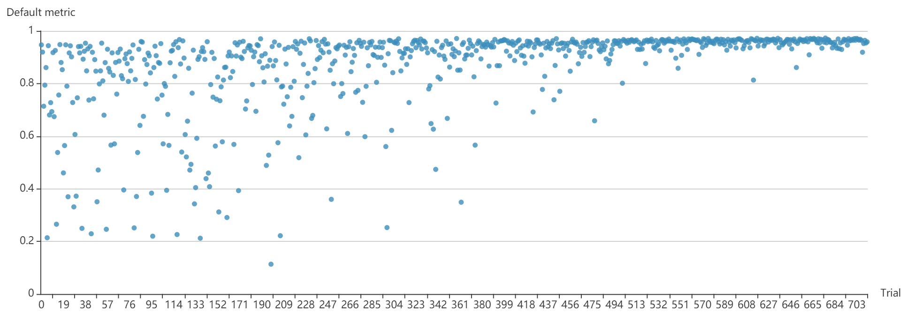
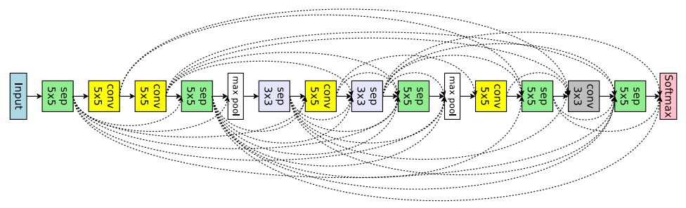

# NNI 中的 PPO Tuner

## PPOTuner

这是通常用于 NAS 接口的 NNI Tuner，使用了 [PPO 算法](https://arxiv.org/abs/1707.06347)。 此实现继承了[这里](https://github.com/openai/baselines/tree/master/baselines/ppo2)的主要逻辑，(即 OpenAI 的 PPO2)，并为 NAS 场景做了适配。

它能成功调优 [mnist-nas 示例](https://github.com/microsoft/nni/tree/master/examples/trials/mnist-nas)，结果如下：

我们也使用 NAS 接口和 PPO Tuner 调优了[ ENAS 论文中为图片分类所做的宏分类](https://github.com/microsoft/nni/tree/master/examples/trials/nas_cifar10)（Trial 中 Epoch 限定为 8）。 [enas 论文](https://arxiv.org/pdf/1802.03268.pdf)中的图 7 展示了搜索空间：

上图是某个选定的架构，用来展示搜索空间。 每个方块是一层，其操作可从 6 个操作中选择。 每条虚线是直通连接，每个方块都可以有 0 或 1 条直通连接获得前面层的输出。 **注意**，在原始的宏搜索空间中，每个方块层可选择任意条直通连接，在此实现中，仅允许 0 或 1条。

结果如下图所示（[配置文件](https://github.com/microsoft/nni/blob/master/examples/trials/nas_cifar10/config_ppo.yml)）：

