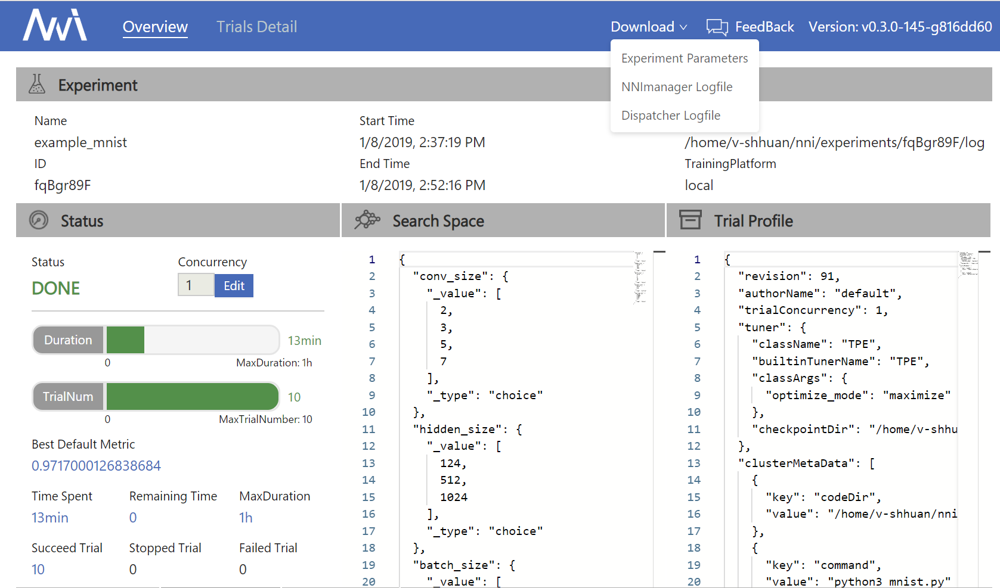
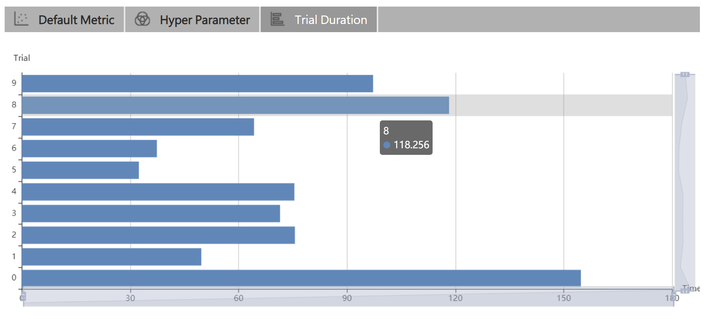
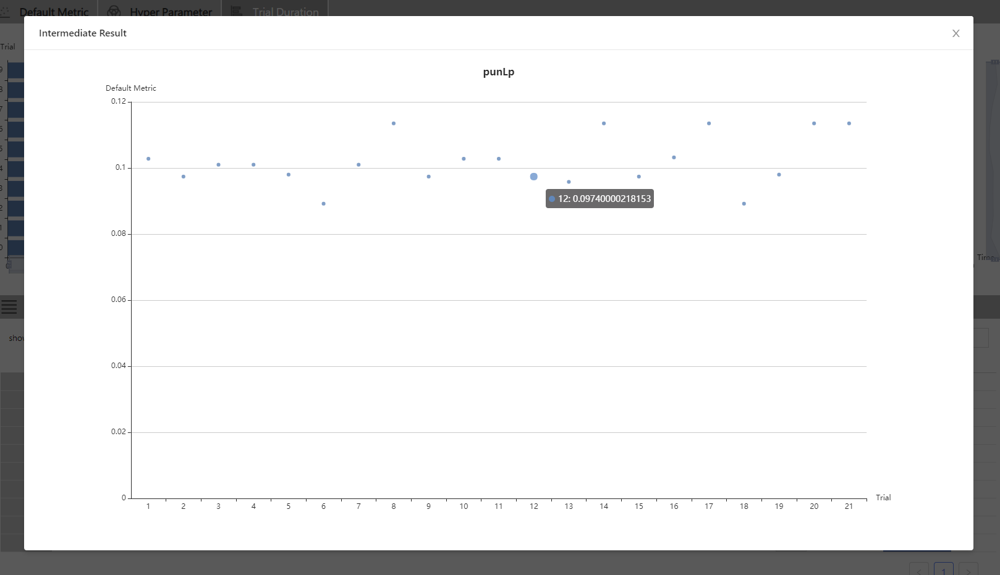

# 快速入门

## 安装

目前支持 Linux、macOS 和 Windows。 Ubuntu 16.04 或更高版本、macOS 10.14.1 和 Windows 10.1809 均经过测试并支持。 在 `python >= 3.6` 的环境中，只需要运行 `pip install` 即可完成安装。

### Linux 和 macOS

```bash
python3 -m pip install --upgrade nni
```

### Windows

```bash
python -m pip install --upgrade nni
```

```eval_rst
.. Note:: 在 Linux 和 macOS 上，如果要将 NNI 安装到当前用户的 home 目录中，可使用 ``--user``；这不需要特殊权限。
```

```eval_rst
.. Note:: 如果出现 ``Segmentation fault`` 这样的错误，参考 :doc:`常见问题 <FAQ>`。
```

```eval_rst
.. Note:: NNI 的系统需求，参考 :doc:`Linux 和 Mac <InstallationLinux>` 或 :doc:`Windows <InstallationWin>` 的安装教程。
```

### Enable NNI Command-line Auto-Completion (Optional)

After the installation, you may want to enable the auto-completion feature for **nnictl** commands. Please refer to this [tutorial](../CommunitySharings/AutoCompletion.md).

## MNIST 上的 "Hello World"

NNI is a toolkit to help users run automated machine learning experiments. It can automatically do the cyclic process of getting hyperparameters, running trials, testing results, and tuning hyperparameters. Here, we'll show how to use NNI to help you find the optimal hyperparameters for a MNIST model.

Here is an example script to train a CNN on the MNIST dataset **without NNI**:

```python
def run_trial(params):
    # 输入数据
    mnist = input_data.read_data_sets(params['data_dir'], one_hot=True)
    # 构建网络
    mnist_network = MnistNetwork(channel_1_num=params['channel_1_num'],
                                 channel_2_num=params['channel_2_num'],
                                 conv_size=params['conv_size'],
                                 hidden_size=params['hidden_size'],
                                 pool_size=params['pool_size'],
                                 learning_rate=params['learning_rate'])
    mnist_network.build_network()

    test_acc = 0.0
    with tf.Session() as sess:
        # 训练网络
        mnist_network.train(sess, mnist)
        # 评估网络
        test_acc = mnist_network.evaluate(mnist)

if __name__ == '__main__':
    params = {'data_dir': '/tmp/tensorflow/mnist/input_data',
              'dropout_rate': 0.5,
              'channel_1_num': 32,
              'channel_2_num': 64,
              'conv_size': 5,
              'pool_size': 2,
              'hidden_size': 1024,
              'learning_rate': 1e-4,
              'batch_num': 2000,
              'batch_size': 32}
    run_trial(params)
```

If you want to see the full implementation, please refer to [examples/trials/mnist-tfv1/mnist_before.py](https://github.com/Microsoft/nni/tree/master/examples/trials/mnist-tfv1/mnist_before.py).

The above code can only try one set of parameters at a time; if we want to tune learning rate, we need to manually modify the hyperparameter and start the trial again and again.

NNI is born to help the user do tuning jobs; the NNI working process is presented below:

```text
输入: 搜索空间, Trial 代码, 配置文件
输出: 一组最优的参数配置

1: For t = 0, 1, 2, ..., maxTrialNum,
2:      hyperparameter = 从搜索空间选择一组参数
3:      final result = run_trial_and_evaluate(hyperparameter)
4:      返回最终结果给 NNI
5:      If 时间达到上限,
6:          停止实验
7: 返回最好的实验结果
```

If you want to use NNI to automatically train your model and find the optimal hyper-parameters, you need to do three changes based on your code:

### Three steps to start an experiment

**Step 1**: Write a `Search Space` file in JSON, including the `name` and the `distribution` (discrete-valued or continuous-valued) of all the hyperparameters you need to search.

```diff
-   params = {'data_dir': '/tmp/tensorflow/mnist/input_data', 'dropout_rate': 0.5, 'channel_1_num': 32, 'channel_2_num': 64,
-   'conv_size': 5, 'pool_size': 2, 'hidden_size': 1024, 'learning_rate': 1e-4, 'batch_num': 2000, 'batch_size': 32}
+ {
+     "dropout_rate":{"_type":"uniform","_value":[0.5, 0.9]},
+     "conv_size":{"_type":"choice","_value":[2,3,5,7]},
+     "hidden_size":{"_type":"choice","_value":[124, 512, 1024]},
+     "batch_size": {"_type":"choice", "_value": [1, 4, 8, 16, 32]},
+     "learning_rate":{"_type":"choice","_value":[0.0001, 0.001, 0.01, 0.1]}
+ }
```

*Example: [search_space.json](https://github.com/Microsoft/nni/tree/master/examples/trials/mnist-tfv1/search_space.json)*

**Step 2**: Modify your `Trial` file to get the hyperparameter set from NNI and report the final result to NNI.

```diff
+ import nni

  def run_trial(params):
      mnist = input_data.read_data_sets(params['data_dir'], one_hot=True)

      mnist_network = MnistNetwork(channel_1_num=params['channel_1_num'], channel_2_num=params['channel_2_num'], conv_size=params['conv_size'], hidden_size=params['hidden_size'], pool_size=params['pool_size'], learning_rate=params['learning_rate'])
      mnist_network.build_network()

      with tf.Session() as sess:
          mnist_network.train(sess, mnist)
          test_acc = mnist_network.evaluate(mnist)

+         nni.report_final_result(test_acc)

  if __name__ == '__main__':

-     params = {'data_dir': '/tmp/tensorflow/mnist/input_data', 'dropout_rate': 0.5, 'channel_1_num': 32, 'channel_2_num': 64,
-     'conv_size': 5, 'pool_size': 2, 'hidden_size': 1024, 'learning_rate': 1e-4, 'batch_num': 2000, 'batch_size': 32}
+     params = nni.get_next_parameter()
      run_trial(params)
```

*Example: [mnist.py](https://github.com/Microsoft/nni/tree/master/examples/trials/mnist-tfv1/mnist.py)*

**Step 3**: Define a `config` file in YAML which declares the `path` to the search space and trial files. It also gives other information such as the tuning algorithm, max trial number, and max duration arguments.

```yaml
authorName: default
experimentName: example_mnist
trialConcurrency: 1
maxExecDuration: 1h
maxTrialNum: 10
trainingServicePlatform: local
# 搜索空间文件
searchSpacePath: search_space.json
useAnnotation: false
tuner:
  builtinTunerName: TPE
# 运行的命令，以及 Trial 代码的路径
trial:
  command: python3 mnist.py
  codeDir: .
  gpuNum: 0
```

```eval_rst
.. Note:: 如果要使用远程计算机或集群作为 :doc:`训练平台 <../TrainingService/Overview>`，为了避免产生过大的网络压力，NNI 限制了文件的最大数量为 2000，大小为 300 MB。 如果 codeDir 中包含了过多的文件，可添加 ``.nniignore`` 文件来排除部分，与 ``.gitignore`` 文件用法类似。 参考 `git documentation <https://git-scm.com/docs/gitignore#_pattern_format>` ，了解更多如何编写此文件的详细信息 _。
```

*Example: [config.yml](https://github.com/Microsoft/nni/tree/master/examples/trials/mnist-tfv1/config.yml) [.nniignore](https://github.com/Microsoft/nni/tree/master/examples/trials/mnist-tfv1/.nniignore)*

All the code above is already prepared and stored in [examples/trials/mnist-tfv1/](https://github.com/Microsoft/nni/tree/master/examples/trials/mnist-tfv1).

#### Linux 和 macOS

Run the **config.yml** file from your command line to start an MNIST experiment.

```bash
nnictl create --config nni/examples/trials/mnist-tfv1/config.yml
```

#### Windows

Run the **config_windows.yml** file from your command line to start an MNIST experiment.

```bash
nnictl create --config nni\examples\trials\mnist-tfv1\config_windows.yml
```

```eval_rst
.. Note:: 如果使用 Windows，则需要在 config.yml 文件中，将 ``python3`` 改为 ``python``，或者使用 config_windows.yml 来开始 Experiment。
```

```eval_rst
.. Note:: ``nnictl`` 是一个命令行工具，用来控制 NNI Experiment，如启动、停止、继续 Experiment，启动、停止 NNIBoard 等等。 点击 :doc:`这里 <Nnictl>` 查看 ``nnictl`` 的更多用法。
```

Wait for the message `INFO: Successfully started experiment!` in the command line. This message indicates that your experiment has been successfully started. And this is what we expect to get:

```text
INFO: Starting restful server...
INFO: Successfully started Restful server!
INFO: Setting local config...
INFO: Successfully set local config!
INFO: Starting experiment...
INFO: Successfully started experiment!
-----------------------------------------------------------------------
The experiment id is egchD4qy
The Web UI urls are: [Your IP]:8080
-----------------------------------------------------------------------

You can use these commands to get more information about the experiment
-----------------------------------------------------------------------
         commands                       description

1. nnictl experiment show        show the information of experiments
2. nnictl trial ls               list all of trial jobs
3. nnictl top                    monitor the status of running experiments
4. nnictl log stderr             show stderr log content
5. nnictl log stdout             show stdout log content
6. nnictl stop                   stop an experiment
7. nnictl trial kill             kill a trial job by id
8. nnictl --help                 get help information about nnictl
-----------------------------------------------------------------------
```

If you prepared `trial`, `search space`, and `config` according to the above steps and successfully created an NNI job, NNI will automatically tune the optimal hyper-parameters and run different hyper-parameter sets for each trial according to the requirements you set. You can clearly see its progress through the NNI WebUI.

## Web 界面

After you start your experiment in NNI successfully, you can find a message in the command-line interface that tells you the `Web UI url` like this:

```text
Web 地址为：[IP 地址]:8080
```

Open the `Web UI url` (Here it's: `[Your IP]:8080`) in your browser; you can view detailed information about the experiment and all the submitted trial jobs as shown below. If you cannot open the WebUI link in your terminal, please refer to the [FAQ](FAQ.md).

### View summary page

Click the "Overview" tab.

Information about this experiment will be shown in the WebUI, including the experiment trial profile and search space message. NNI also supports downloading this information and the parameters through the **Download** button. You can download the experiment results anytime while the experiment is running, or you can wait until the end of the execution, etc.



The top 10 trials will be listed on the Overview page. You can browse all the trials on the "Trials Detail" page.


### View trials detail page

Click the "Default Metric" tab to see the point graph of all trials. Hover to see specific default metrics and search space messages.


Click the "Hyper Parameter" tab to see the parallel graph.

* 可选择百分比查看最好的 Trial。
* 选择两个轴来交换位置。


Click the "Trial Duration" tab to see the bar graph.



Below is the status of all trials. Specifically:

* Trial 详情：Trial 的 id，持续时间，开始时间，结束时间，状态，精度和搜索空间文件。
* 如果在 OpenPAI 平台上运行，还可以看到 hdfsLog。
* Kill: 可结束在 `Running` 状态的任务。
* Support: 用于搜索某个指定的 Trial。


* 中间结果图



## 相关主题

* [尝试不同的 Tuner](../Tuner/BuiltinTuner.md)
* [尝试不同的 Assessor](../Assessor/BuiltinAssessor.md)
* [使用命令行工具 nnictl](Nnictl.md)
* [如何实现 Trial 代码](../TrialExample/Trials.md)
* [如何在本机运行 Experiment (支持多 GPU 卡)？](../TrainingService/LocalMode.md)
* [如何在多机上运行 Experiment？](../TrainingService/RemoteMachineMode.md)
* [如何在 OpenPAI 上运行 Experiment？](../TrainingService/PaiMode.md)
* [如何通过 Kubeflow 在 Kubernetes 上运行 Experiment？](../TrainingService/KubeflowMode.md)
* [如何通过 FrameworkController 在 Kubernetes 上运行 Experiment？](../TrainingService/FrameworkControllerMode.md)