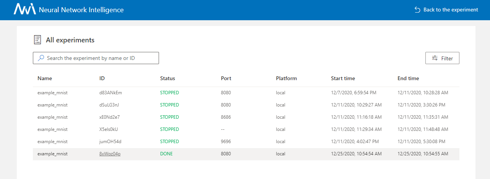

快速入门
==========

安装
------------

目前支持 Linux、macOS 和 Windows。 Ubuntu 16.04 或更高版本、macOS 10.14.1 和 Windows 10.1809 均经过测试并支持。 在 ``python >= 3.6`` 环境中，只需运行 ``pip install`` 即可完成安装。

Linux 和 macOS
^^^^^^^^^^^^^^^

.. code-block:: bash

   python3 -m pip install --upgrade nni

Windows
^^^^^^^

.. code-block:: bash

   python -m pip install --upgrade nni

.. Note:: 在 Linux 和 macOS 上，如果要将 NNI 安装到当前用户的 home 目录中，可使用 ``--user`` ；这不需要特殊权限。

.. Note:: 如果出现 ``Segmentation fault`` 这样的错误，参考 :doc:`常见问题 <FAQ>` 。

.. Note:: NNI 的系统需求，参考 :doc:`Linux & Mac <InstallationLinux>` 或者 :doc:`Windows <InstallationWin>`. 的安装教程。

启用 NNI 命令行自动补全（可选）
^^^^^^^^^^^^^^^^^^^^^^^^^^^^^^^^^^^^^^^^^^^^^^^^^^

在安装之后，您可能需要启用 **nnictl** 命令的自动补全功能。 请阅读 `教程 <../CommunitySharings/AutoCompletion.rst>`__。

MNIST 上的 "Hello World"
------------------------------

NNI 是一个能进行自动机器学习实验的工具包。 它可以自动进行获取超参、运行 Trial，测试结果，调优超参的循环。 在这里，将演示如何使用 NNI 帮助找到 MNIST 模型的最佳超参数。

这是还 **没有 NNI** 的示例代码，用 CNN 在 MNIST 数据集上训练：

.. code-block:: python

    def main(args):
        # 下载数据
        train_loader = torch.utils.data.DataLoader(datasets.MNIST(...), batch_size=args['batch_size'], shuffle=True)
        test_loader = torch.tuils.data.DataLoader(datasets.MNIST(...), batch_size=1000, shuffle=True)
        # 构建模型
        model = Net(hidden_size=args['hidden_size'])
        optimizer = optim.SGD(model.parameters(), lr=args['lr'], momentum=args['momentum'])
        # 训练
        for epoch in range(10):
            train(args, model, device, train_loader, optimizer, epoch)
            test_acc = test(args, model, device, test_loader)
            print(test_acc)
        print('final accuracy:', test_acc)
         
    if __name__ == '__main__':
        params = {
            'batch_size': 32,
            'hidden_size': 128,
            'lr': 0.001,
            'momentum': 0.5
        }
        main(params)

上面的代码一次只能尝试一组参数，如果想要调优学习率，需要手工改动超参，并一次次尝试。

NNI 用来帮助超参调优。它的流程如下：

.. code-block:: text

   输入: 搜索空间, Trial 代码, 配置文件
   输出: 一组最优的参数配置

   1: For t = 0, 1, 2, ..., maxTrialNum,
   2:      hyperparameter = 从搜索空间选择一组参数
   3:      final result = run_trial_and_evaluate(hyperparameter)
   4:      返回最终结果给 NNI
   5:      If 时间达到上限,
   6:          停止实验
   7: 返回最好的实验结果

如果需要使用 NNI 来自动训练模型，找到最佳超参，需要根据代码，进行如下三步改动：

启动 Experiment 的三个步骤
^^^^^^^^^^^^^^^^^^^^^^^^^^^^^^^^^^

**第一步** ：编写 JSON 格式的 ``搜索空间`` 文件，包括所有需要搜索的超参的 ``名称`` 和 ``分布`` （离散和连续值均可）。

.. code-block:: diff

    -   params = {'batch_size': 32, 'hidden_size': 128, 'lr': 0.001, 'momentum': 0.5}
    +   {
    +       "batch_size": {"_type":"choice", "_value": [16, 32, 64, 128]},
    +       "hidden_size":{"_type":"choice","_value":[128, 256, 512, 1024]},
    +       "lr":{"_type":"choice","_value":[0.0001, 0.001, 0.01, 0.1]},
    +       "momentum":{"_type":"uniform","_value":[0, 1]}
    +   }

*示例:* :githublink:`search_space.json <examples/trials/mnist-pytorch/search_space.json>`

**第二步** ：修改 ``Trial`` 代码来从 NNI 获取超参，并返回 NNI 最终结果。

.. code-block:: diff

    + import nni

      def main(args):
          # 下载数据
          train_loader = torch.utils.data.DataLoader(datasets.MNIST(...), batch_size=args['batch_size'], shuffle=True)
          test_loader = torch.tuils.data.DataLoader(datasets.MNIST(...), batch_size=1000, shuffle=True)
          # 构造模型
          model = Net(hidden_size=args['hidden_size'])
          optimizer = optim.SGD(model.parameters(), lr=args['lr'], momentum=args['momentum'])
          # 训练
          for epoch in range(10):
              train(args, model, device, train_loader, optimizer, epoch)
              test_acc = test(args, model, device, test_loader)
    -         print(test_acc)
    +         nni.report_intermeidate_result(test_acc)
    -     print('final accuracy:', test_acc)
    +     nni.report_final_result(test_acc)
           
      if __name__ == '__main__':
    -     params = {'batch_size': 32, 'hidden_size': 128, 'lr': 0.001, 'momentum': 0.5}
    +     params = nni.get_next_parameter()
          main(params)

*示例:* :githublink:`mnist.py <examples/trials/mnist-pytorch/mnist.py>`

**第三步**\ : 定义 YAML 格式的 ``配置`` 文件，声明搜索空间和 Trail 文件的 ``路径`` 。 它还提供其他信息，例如调整算法，最大 Trial 运行次数和最大持续时间的参数。

.. code-block:: yaml

   authorName: default
   experimentName: example_mnist
   trialConcurrency: 1
   maxExecDuration: 1h
   maxTrialNum: 10
   trainingServicePlatform: local
   # 搜索空间文件路径
   searchSpacePath: search_space.json
   useAnnotation: false
   tuner:
     builtinTunerName: TPE
   # 运行的命令，以及 Trial 代码的路径
   trial:
     command: python3 mnist.py
     codeDir: .
     gpuNum: 0

.. Note:: 如果要使用远程计算机或集群作为 :doc:`训练平台 <../TrainingService/Overview>`，为了避免产生过大的网络压力，NNI 限制了文件的最大数量为 2000，大小为 300 MB。 如果 codeDir 中包含了过多的文件，可添加 ``.nniignore`` 文件来排除部分，与 ``.gitignore`` 文件用法类似。 参考 `git documentation <https://git-scm.com/docs/gitignore#_pattern_format>`__ ，了解更多如何编写此文件的详细信息 _。

*示例:* :githublink:`config.yml <examples/trials/mnist-pytorch/config.yml>` 和 :githublink:`.nniignore <examples/trials/mnist-pytorch/.nniignore>`

上面的代码都已准备好，并保存在 :githublink:`examples/trials/mnist-pytorch/ <examples/trials/mnist-pytorch>`。

Linux 和 macOS
^^^^^^^^^^^^^^^

从命令行使用 **config.yml** 文件启动 MNIST Experiment 。

.. code-block:: bash

   nnictl create --config nni/examples/trials/mnist-pytorch/config.yml

Windows
^^^^^^^

从命令行使用**config_windows.yml** 文件启动 MNIST Experiment 。

.. code-block:: bash

   nnictl create --config nni\examples\trials\mnist-pytorch\config_windows.yml

.. Note:: 如果使用 Windows，则需要在 config.yml 文件中，将 ``python3`` 改为 ``python``，或者使用 config_windows.yml 来开始 Experiment。

.. Note:: ``nnictl`` 是一个命令行工具，用来控制 NNI Experiment，如启动、停止、继续 Experiment，启动、停止 NNIBoard 等等。 点击 :doc:`这里 <Nnictl>` 查看 ``nnictl`` 的更多用法。

在命令行中等待输出 ``INFO: Successfully started experiment!`` 。 此消息表明实验已成功启动。 期望的输出如下：

.. code-block:: text

   INFO: Starting restful server...
   INFO: Successfully started Restful server!
   INFO: Setting local config...
   INFO: Successfully set local config!
   INFO: Starting experiment...
   INFO: Successfully started experiment!
   -----------------------------------------------------------------------
   The experiment id is egchD4qy
   The Web UI urls are: [Your IP]:8080
   -----------------------------------------------------------------------

   You can use these commands to get more information about the experiment
   -----------------------------------------------------------------------
            commands                       description
   1. nnictl experiment show        show the information of experiments
   2. nnictl trial ls               list all of trial jobs
   3. nnictl top                    monitor the status of running experiments
   4. nnictl log stderr             show stderr log content
   5. nnictl log stdout             show stdout log content
   6. nnictl stop                   stop an experiment
   7. nnictl trial kill             kill a trial job by id
   8. nnictl --help                 get help information about nnictl
   -----------------------------------------------------------------------

如果根据上述步骤准备好了相应 ``Trial`` ， ``搜索空间`` 和 ``配置`` ，并成功创建的 NNI 任务。NNI 会自动开始通过配置的搜索空间来运行不同的超参集合，搜索最好的超参。 通过 Web 界面可看到 NNI 的进度。

Web 界面
---------------

启动 Experiment 后，可以在命令行界面找到如下的 ``Web 界面地址`` ：

.. code-block:: text

   The Web UI urls are: [Your IP]:8080

在浏览器中打开 ``Web 界面地址`` （即：`` [IP 地址]:8080`` ），就可以看到 Experiment 的详细信息，以及所有的 Trial 任务。 如果无法打开终端中的 Web 界面链接，可以参考 `常见问题 <FAQ.rst>`__。

查看概要页面
^^^^^^^^^^^^^^^^^^

Experiment 相关信息会显示在界面上，配置和搜索空间等。 NNI 还支持通过 **Experiment summary** 按钮下载这些信息和参数。

.. image:: ../../img/webui-img/full-oview.png
   :target: ../../img/webui-img/full-oview.png
   :alt: overview

查看 Trial 详情页面
^^^^^^^^^^^^^^^^^^^^^^^

可以在此页面中看到最佳的试用指标和超参数图。 当您单击按钮 ``Add/Remove columns`` 时，表格内容包括更多列。

.. image:: ../../img/webui-img/full-detail.png
   :target: ../../img/webui-img/full-detail.png
   :alt: detail

查看 Experiment 管理页面
^^^^^^^^^^^^^^^^^^^^^^^^^^^^^^^^

``All experiments`` 页面可以查看计算机上的所有实验。 

更多信息可参考 `此文档 <./WebUI.rst>`__。

相关主题
-------------

* `尝试不同的 Tuner <../Tuner/BuiltinTuner.rst>`__
* `尝试不同的 Assessor <../Assessor/BuiltinAssessor.rst>`__
* `如何使用命令行工具 nnictl <Nnictl.rst>`__
* `如何实现 Trial 代码 <../TrialExample/Trials.rst>`__
* `如何在本机运行 Experiment (支持多 GPU 卡)？ <../TrainingService/LocalMode.rst>`__
* `如何在多机上运行 Experiment？ <../TrainingService/RemoteMachineMode.rst>`__
* `如何在 OpenPAI 上运行 Experiment？ <../TrainingService/PaiMode.rst>`__
* `如何通过 Kubeflow 在 Kubernetes 上运行 Experiment？ <../TrainingService/KubeflowMode.rst>`__
* `如何通过 FrameworkController 在 Kubernetes 上运行 Experiment？ <../TrainingService/FrameworkControllerMode.rst>`__
* `如何通过 AdaptDL在 Kubernetes 上运行 Experiment？ <../TrainingService/AdaptDLMode.rst>`__
