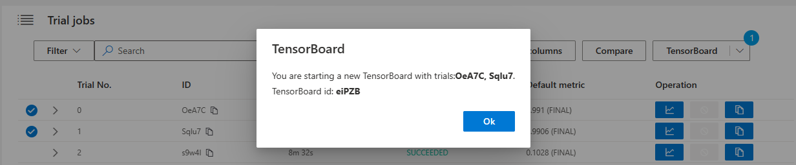
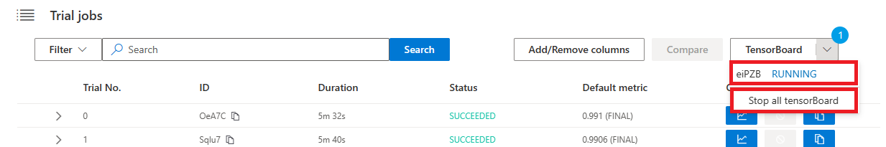

如何在 Web 界面中使用 TensorBoard
====================================================

从 NNI v2.2 开始，您可以在 Web 界面中跨一个或多个 Trial 启动 TensorBoard 进程。 该功能目前支持本地训练平台和共享存储的重用模式下的训练平台，并将在未来的 NNI 版本中支持更多场景。

准备
-----------

确保在您的环境中安装了 TensorBoard。 如果您从未使用过 TensorBoard，这里有入门教程供您参考：`在 TensorFlow 下使用 TensorBoard <https://www.tensorflow.org/tensorboard/get_started>`__, `在 PyTorch 下使用 TensorBoard <https://pytorch.org/tutorials/recipes/recipes/tensorboard_with_pytorch.html>`__。

使用 Web 界面启动 TensorBoard
--------------------------------------------------------

1. 保存日志
^^^^^^^^^^^^

NNI 将自动获取 Trial 输出文件夹下的 ``tensorboard`` 子文件夹作为 tensorboard logdir。 所以在 Trial 的源代码中，你需要将 TensorBoard 日志保存在 ``NNI_OUTPUT_DIR/tensorboard`` 下。 此日志路径可以连接为：

.. code-block:: python

    log_dir = os.path.join(os.environ["NNI_OUTPUT_DIR"], 'tensorboard')

2. 启动 TensorBoard
^^^^^^^^^^^^^^^^^^^^^

像比较一样，首先选择要组合的 Trial 来启动 TensorBoard，然后单击 ``Tensorboard`` 按钮。

.. image:: ../../img/Tensorboard_1.png
   :target: ../../img/Tensorboard_1.png
   :alt: 

点击弹出框中的 "OK "按钮后，你将跳转到 TensorBoard 门户。

你可以在 TensorBoard 门户上看到 ``SequenceID-TrialID``。

3. 全部停用
^^^^^^^^^^^^

如果你想打开已经启动的门户，请点击 tensorboard id。 如果你不再需要 TensorBoard，点击 ``Stop all tensorboard`` 按钮。

