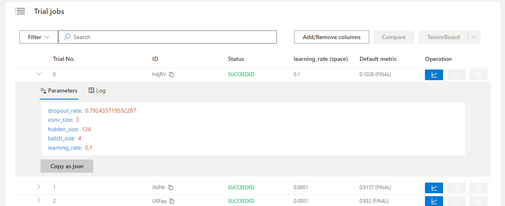

# Web 界面

## 查看概要页面

点击标签 "Overview"。

* 查看 Experiment Trial 配置、搜索空间以及结果好的 Trial。

 

* 如果 Experiment 包含了较多 Trial，可改变刷新间隔。

* 支持查看并下载 Experiment 结果，以及 NNI Manager、Dispatcher 的日志文件。

* 如果 Experiment 状态为 ERROR，可点击图标，查看 Experiment 错误日志。

 

* 点击 "Feedback" 反馈问题。

## 查看任务默认指标

* 点击 "Default Metric" 来查看所有 Trial 的点图。 悬停鼠标来查看默认指标和搜索空间信息。

* 点击开关 "optimization curve" 来查看 Experiment 的优化曲线。

## 查看超参

点击 "Hyper Parameter" 标签查看图像。

* 可选择百分比查看最好的 Trial。
* 选择两个轴来交换位置。

## 查看 Trial 运行时间

点击 "Trial Duration" 标签来查看柱状图。

## 查看 Trial 中间结果

单击 "Intermediate Result" 标签查看折线图。

由于训练中可能有非常多的中间结果，因此中间结果图提供了过滤功能。 如果要使用过滤按钮查看部分 Trial，则需要提供数据。

第一个输入框应该填入什么？ 可能会发现一个 Trial 的中间结果点变得更好或者更差。 换句话说，这可能是非常重要的中间结果点。 只需将其输入第一个输入框中。

选择了中间结果序号后，要输入需要了解的该中间结果序号的指标范围。 即其最小值和最大值。 如此图中，中间结果点为 9，指标范围为 60 至 80。

Trial 中指标范围在 20 至 60 的 13 个结果就被过滤掉了。

## 查看 Trial 状态

点击 "Trials Detail" 标签查看所有 Trial 的状态。 包括：

* Trial 详情：Trial 的 id，持续时间，开始时间，结束时间，状态，精度和搜索空间。

* "Add column" 按钮可选择在表格中显示的列。 如果 Experiment 的最终结果是 dict，则可以在表格中查看其它键。 可选择 "Intermediate count" 列来查看 Trial 进度。

* 如果要比较某些 Trial，可选择并点击 "Compare" 来查看结果。

 

* 支持通过 id，状态，Trial 编号， 以及参数来搜索。

* 可使用 "Copy as python" 按钮来拷贝 Trial 的参数。

* 如果在 OpenPAI 或 Kubeflow 平台上运行，还可以看到 hdfsLog。

* 中间结果图：可在此图中通过点击 operation 中的按钮来查看默认和其它键值。

 

* Kill: 可终止正在运行的任务。

 