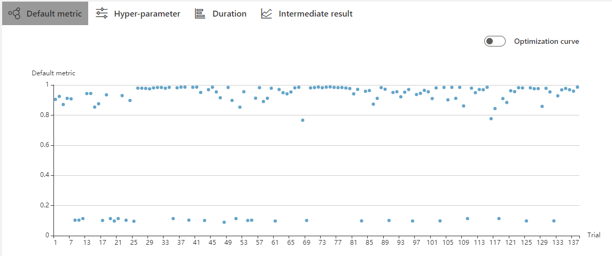
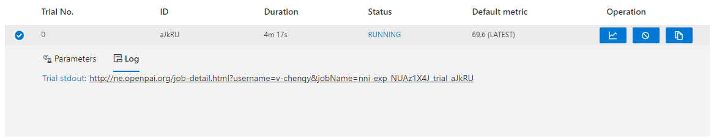

# Web 界面

## 查看概要页面

点击标签 "Overview"。

* On the overview tab, you can see the experiment trial profile/search space and the performance of top trials.

 

* If your experiment has many trials, you can change the refresh interval here.

* You can review and download the experiment results and nni-manager/dispatcher log files from the "View" button.

* You can click the exclamation point in the error box to see a log message if the experiment's status is an error.

 

* You can click "Feedback" to report any questions.

## 查看任务默认指标

* 点击 "Default Metric" 来查看所有 Trial 的点图。 悬停鼠标来查看默认指标和搜索空间信息。

* 点击开关 "optimization curve" 来查看 Experiment 的优化曲线。

## 查看超参

点击 "Hyper Parameter" 标签查看图像。

* 可选择百分比查看最好的 Trial。
* 选择两个轴来交换位置。

## 查看 Trial 运行时间

点击 "Trial Duration" 标签来查看柱状图。

## 查看 Trial 中间结果

Click the tab "Intermediate Result" to see the line graph.

The trial may have many intermediate results in the training process. 为了更清楚的理解一些 Trial 的趋势，可以为中间结果图设置过滤。

You may find that these trials will get better or worse at an intermediate result. This indicates that it is an important and relevant intermediate result. To take a closer look at the point here, you need to enter its corresponding X-value at #Intermediate. Then input the range of metrics on this intermedia result. In the picture below, we choose the No. 4 intermediate result and set the range of metrics to 0.8-1.

## 查看 Trial 状态

Click the tab "Trials Detail" to see the status of all trials. Specifically:

* Trial detail: trial's id, trial's duration, start time, end time, status, accuracy, and search space file.

* The button named "Add column" can select which column to show on the table. If you run an experiment whose final result is a dict, you can see other keys in the table. 可选择 "Intermediate count" 列来查看 Trial 进度。

* 如果要比较某些 Trial，可选择并点击 "Compare" 来查看结果。

 

* 支持通过 id，状态，Trial 编号， 以及参数来搜索。

* You can use the button named "Copy as python" to copy the trial's parameters.

* If you run on the OpenPAI or Kubeflow platform, you can also see the hdfsLog.

* Intermediate Result Graph: you can see the default and other keys in this graph by clicking the operation column button.

 

* Kill: 可终止正在运行的任务。

 