Web 界面
===============

查看概要页面
-----------------

点击标签 "Overview"。

* 在 Overview 标签上，可看到 Experiment Trial 的概况、搜索空间、以及最好的 Trial 结果。 如果想查看实验配置和搜索空间，点击右边的按钮 "Config" 和 "Search space"。

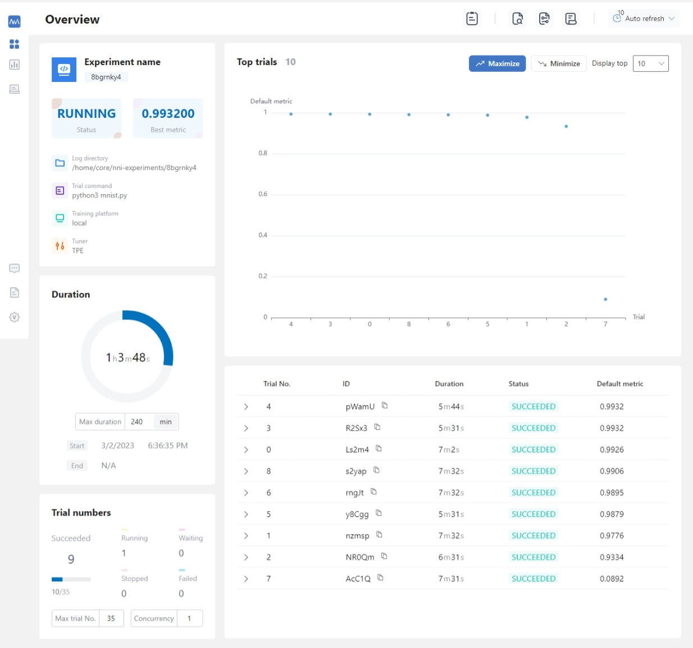

* 如果 Experiment 包含了较多 Trial，可改变刷新间隔。

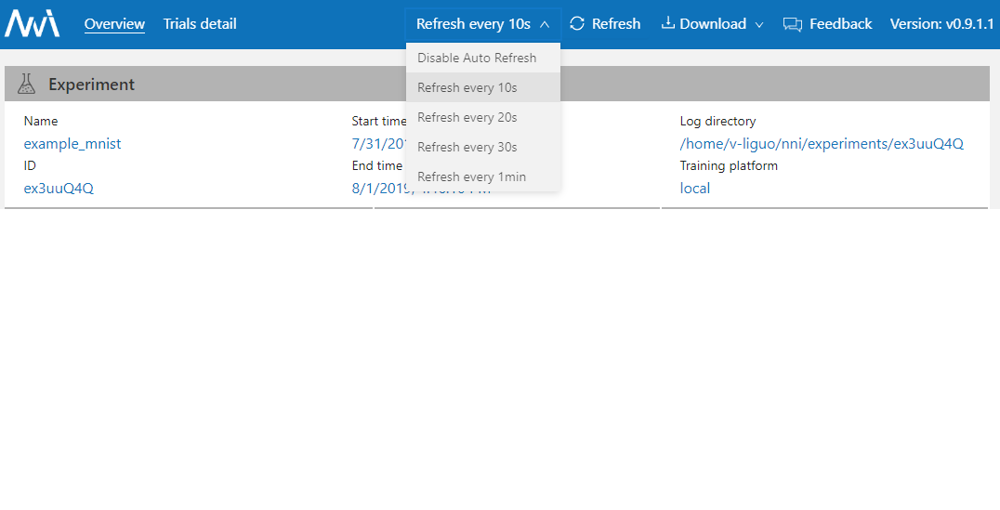

* "download" 按钮支持查看并下载 Experiment 结果，以及 NNI Manager、Dispatcher 的日志文件。

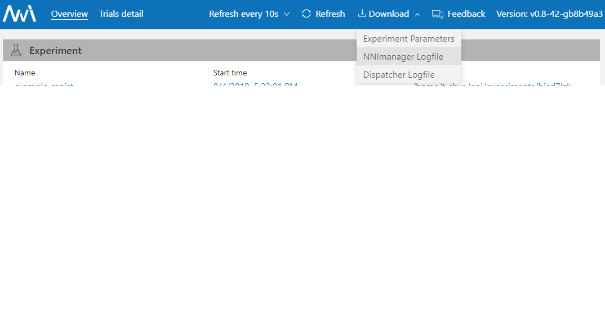

* 在这里修改实验配置（例如 maxExecDuration, maxTrialNum 和 trial concurrency）。

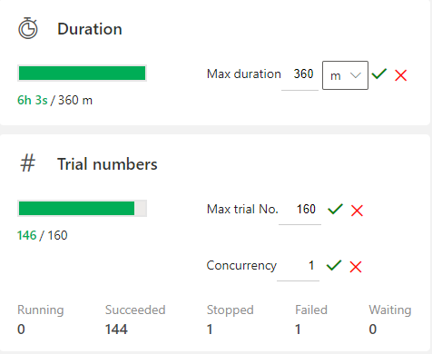

* 如果实验的状态为错误，可以单击错误框中的感叹号来查看日志消息。

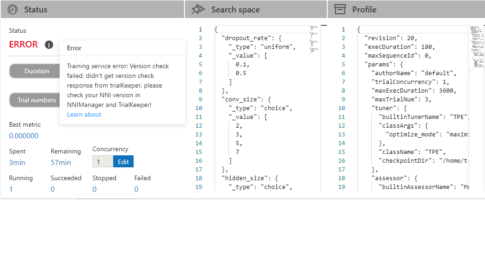

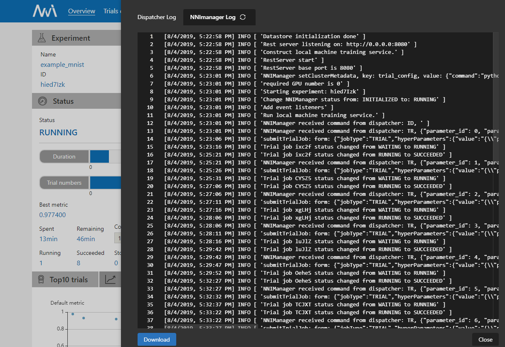

* 可点击 "About" 查看版本信息和反馈任何问题。

查看任务默认指标
-----------------------

* 点击 "Default Metric" 来查看所有 Trial 的点图。 悬停鼠标来查看默认指标和搜索空间信息。

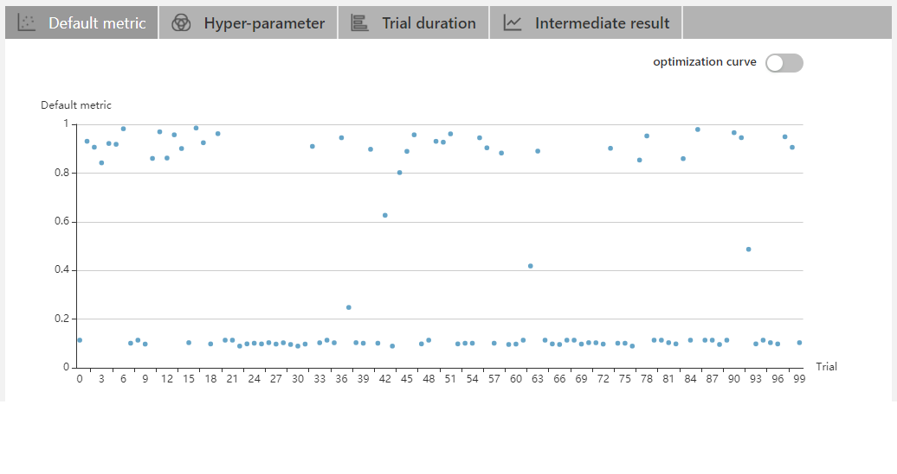

* 点击开关 "optimization curve" 来查看 Experiment 的优化曲线。

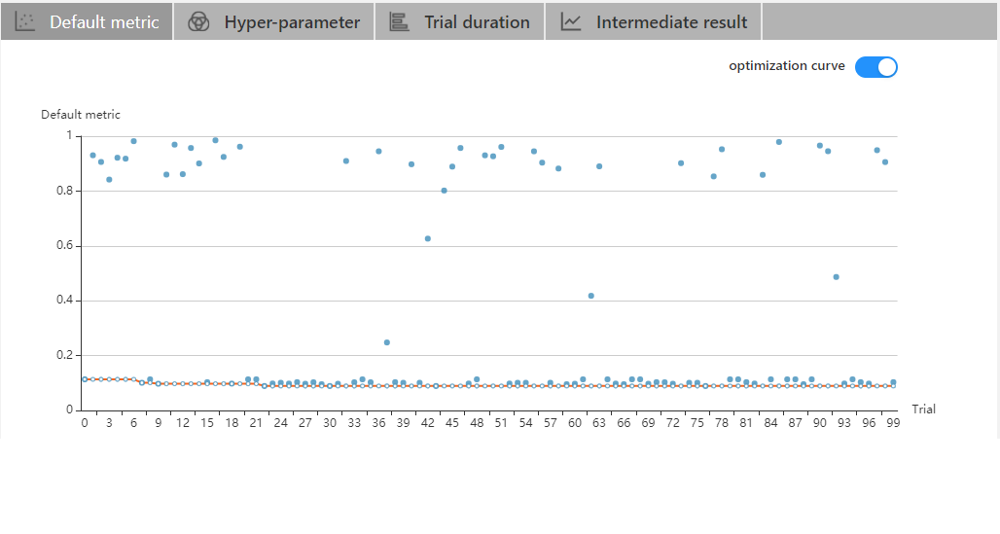

查看超参
--------------------

点击 "Hyper Parameter" 标签查看图像。

* 可以添加/删除轴，或者拖动以交换图表上的轴。
* 可选择百分比查看最好的 Trial。

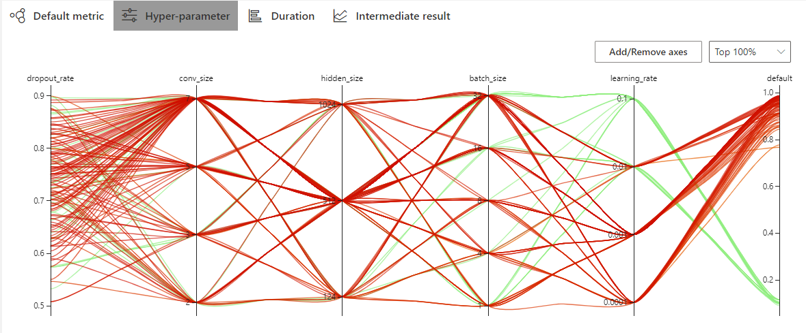

查看 Trial 运行时间
-------------------

点击 "Trial Duration" 标签来查看柱状图。

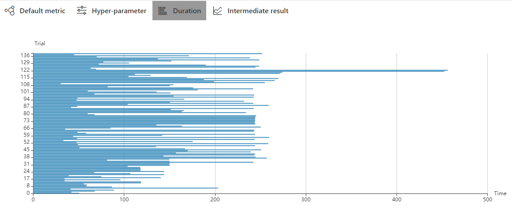

查看 Trial 中间结果
------------------------------------

单击 "Intermediate Result" 标签查看折线图。

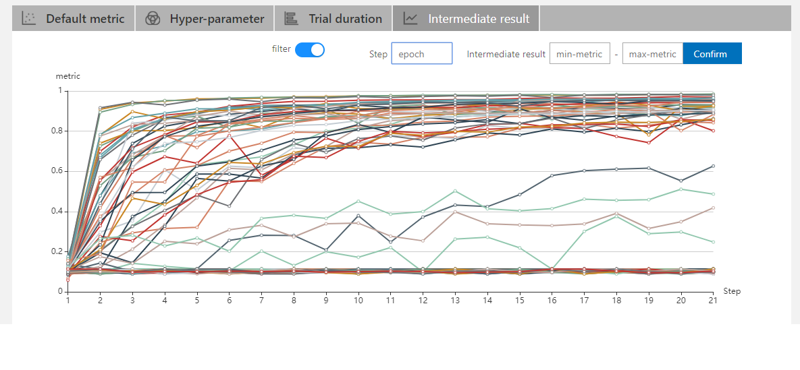

Trial 可能在训练过程中有大量中间结果。 为了更清楚的理解一些 Trial 的趋势，可以为中间结果图设置过滤。

这样可以发现 Trial 在某个中间结果上会变得更好或更差。 这表明它是一个重要的并相关的中间结果。 如果要仔细查看这个点，可以在 #Intermediate 中输入其 X 坐标。 并输入这个中间结果的指标范围。 在下图中，选择了 No。 并将指标范围设置为了 0.8 -1。

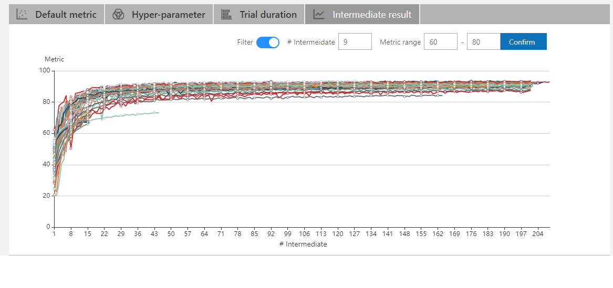

查看 Trial 状态
------------------

点击 "Trials Detail" 标签查看所有 Trial 的状态。 特别是：

* Trial 详情：Trial 的 id，持续时间，开始时间，结束时间，状态，精度和搜索空间文件。

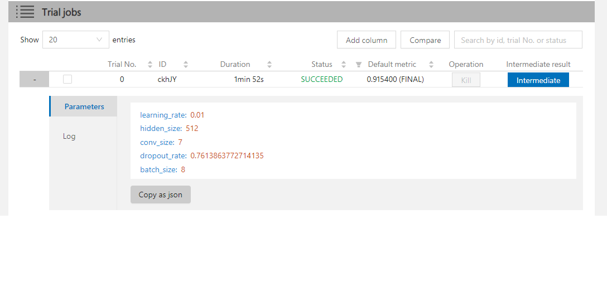

* "Add column" 按钮可选择在表格中显示的列。 如果 Experiment 的最终结果是 dict，则可以在表格中查看其它键。 可选择 "Intermediate count" 列来查看 Trial 进度。

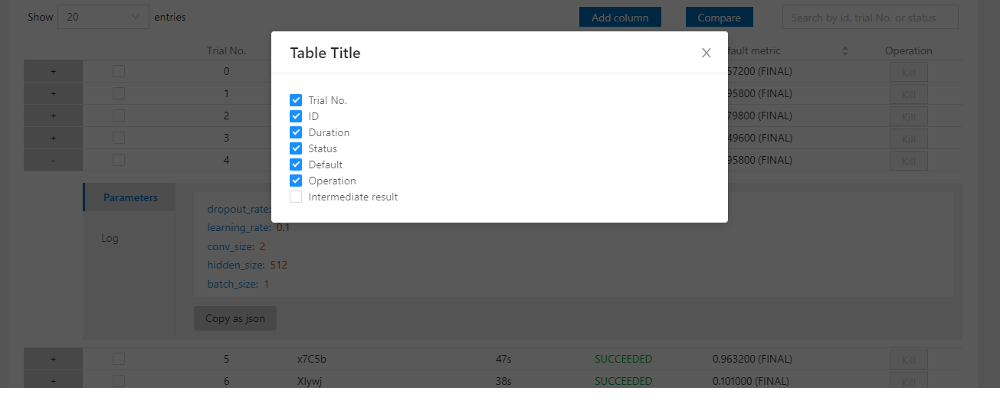

* 如果要比较某些 Trial，可选择并点击 "Compare" 来查看结果。

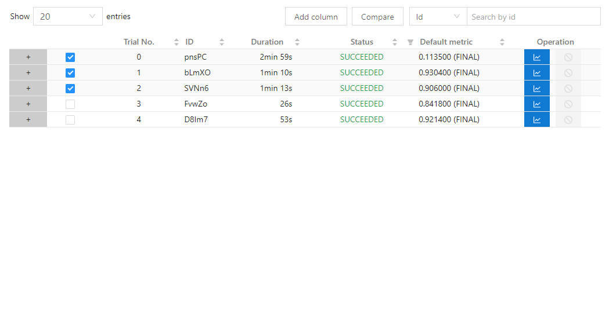

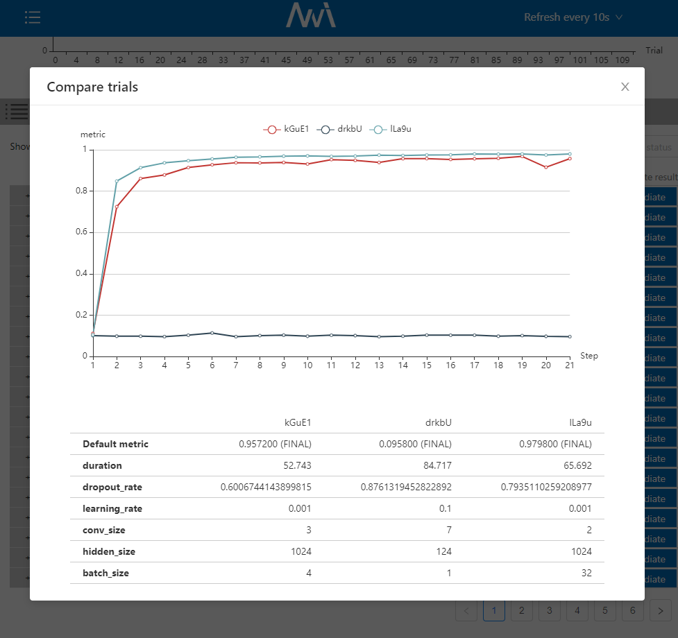

* 支持通过 id，状态，Trial 编号， 以及参数来搜索。

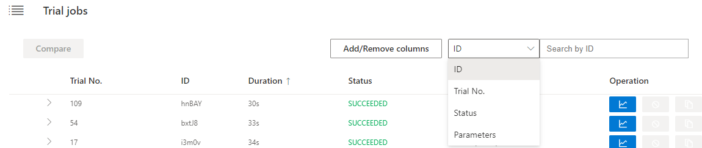

* 可使用 "Copy as python" 按钮来拷贝 Trial 的参数。

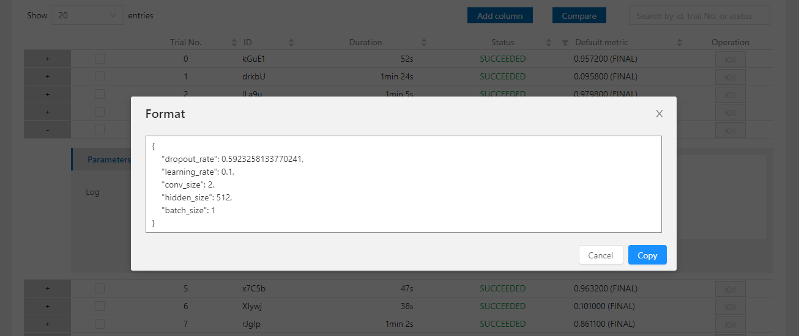

* 如果在 OpenPAI 或 Kubeflow 平台上运行，还可以看到 hdfsLog。

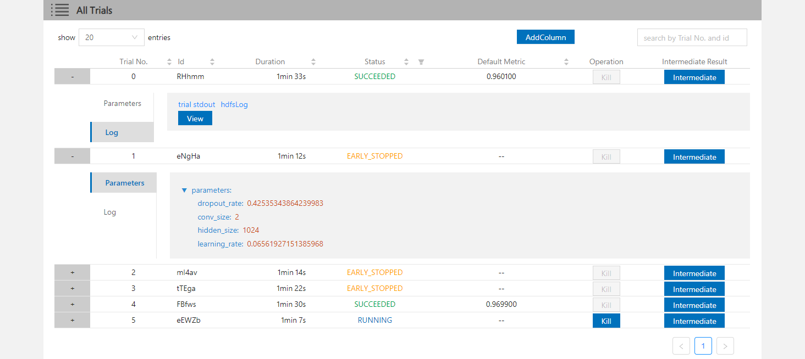

* 中间结果图：可在此图中通过点击 intermediate 按钮来查看默认指标。

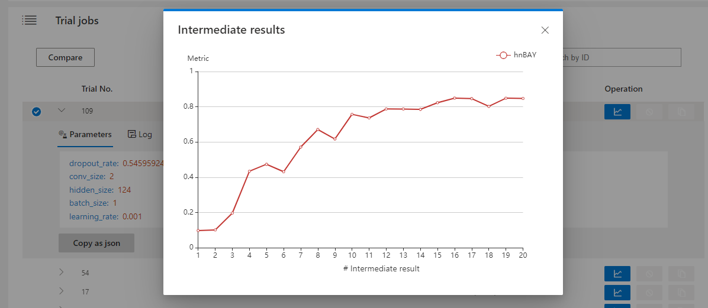

* Kill: 可终止正在运行的任务。

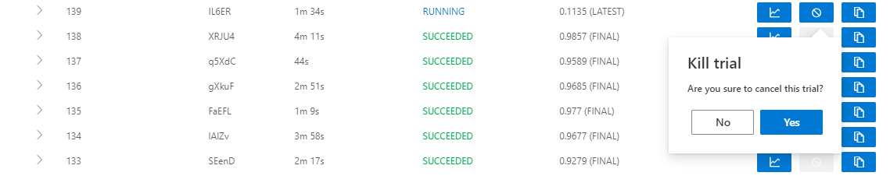

