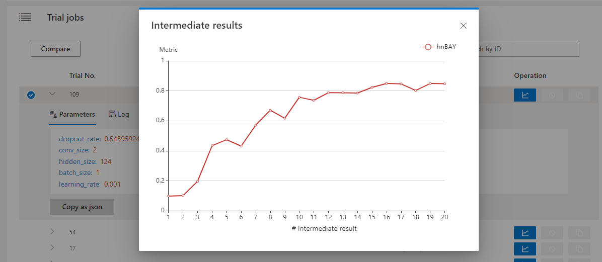

# Web 界面

## 查看概要页面

点击标签 "Overview"。

* 查看 Experiment 的配置和搜索空间内容。
* 支持下载 Experiment 结果。
* 支持导出 nni-manager 和 dispatcher 的日志文件。
* 如果有任何问题，可以点击 “Feedback” 告诉我们。
* If your experiment have more than 1000 trials, you can change the refresh interval on here.

* 查看最好结果的 Trial。

## 查看任务默认指标

点击 "Default Metric" 来查看所有 Trial 的点图。 悬停鼠标来查看默认指标和搜索空间信息。

## 查看超参

点击 "Hyper Parameter" 标签查看图像。

* 可选择百分比查看最好的 Trial。
* 选择两个轴来交换位置。

## 查看 Trial 运行时间

点击 "Trial Duration" 标签来查看柱状图。

## 查看 Trial 中间结果

单击 "Intermediate Result" 标签查看折线图。

该图有筛选功能。 点击筛选按钮， 在第一个输入框中输入关注点的序号， 在第二个输入框中输入中间结果的范围，选出需要的数据。

## 查看 Trial 状态

点击 "Trials Detail" 标签查看所有 Trial 的状态。 特别是：

* Trial 详情：Trial 的 id，持续时间，开始时间，结束时间，状态，精度和搜索空间。

* "Add column" 按钮可选择在表格中显示的列。 如果 Experiment 的最终结果是 dict，则可以在表格中查看其它键。

* If you want to compare some trials, you can select them and then click "Compare" to see the results.

* You can use the button named "Copy as python" to copy trial's parameters.

* If you run on OpenPAI or Kubeflow platform, you can also see the hdfsLog.

* Kill: you can kill a job that status is running.
* Support to search for a specific trial.
* Intermediate Result Graph: you can see default and other keys in this graph.

