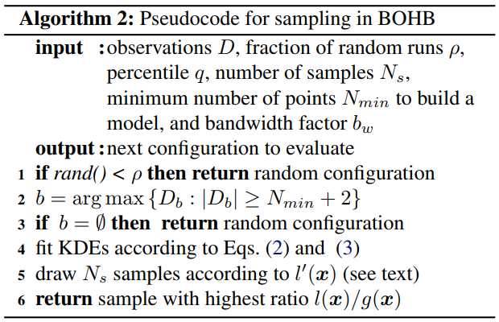

# NNI中的BOHB Advisor

## 1. 介绍

BOHB是由[此篇参考论文](https://arxiv.org/abs/1807.01774)提出的一种高效而稳定的调参算法。 BO 是贝叶斯优化的缩写，HB是强盗算法Hyperband的缩写。

BOHB 依赖 HB（Hyperband）来决定每次跑多少组参数和每组参数分配多少资源（budget），**它的改进之处是它将Hyperband在每个循环开始时随机选择参数的方法替换成了依赖之前的数据建立模型（贝叶斯优化） 进行参数选择**. 一旦贝叶斯优化生成的参数达到迭代所需的配置数, 就会使用这些配置开始执行标准的连续减半过程（successive halving）。 我们观察这些参数在不同资源配置（budget）下的表现g(x, b)，用于在以后的迭代中用作我们贝叶斯优化模型选择参数的基准数据。

接下来我们将份两部分来介绍BOHB过程涉及的原理:

### HB（Hyperband）

我们按照Hyperband 的方式来选择每次跑的参数个数与分配多少资源（budget），并继续使用“连续减半（SuccessiveHalving）”策略，更多有关Hyperband算法的细节，请参考[NNI中的Hyperband](hyperbandAdvisor.md)和[Hyperband 的参考论文](https://arxiv.org/abs/1603.06560)。 下面的伪代码描述了这个过程。


### BO（贝叶斯优化）

BOHB 的 BO 部分与 TPE 非常相似, 它们的主要区别是: BOHB中我们使用一个多维的KDE, 而不是TPE那样带有权重的一维 KDEs, 以便更好地处理搜索空间中超参之间的互相影响。

树形超参评估器 (TPE): 使用 KDE (核密度估计) 来对密度进行建模。


为了建模有效的核密度估计（KDE），我们设置了一个建立模型所需的最小观察点数（Nmin），在我们的实验中它的默认值为d+1（d是搜索空间的维度），其中d也是一个可以设置的超参数。 因为我们希望尽早地建立模型，所以当Nb = |Db|，即当已经观察到的计算资源（budget）为b的点数满足q · Nb ≥ Nmin时，我们立马建立模型来指导之后参数的选择。所以，在我们使用了刚开始Nmin + 2 个随机选择的参数之后，我们会按照下式将我们观察到的点进行分类


按照这个式子将观察到的点分成好的点与坏的点两类，来分别拟合两个不同的密度分布。

注意为了鼓励更多的探索防止陷入局部极小，在建立模型之后我们仍然有**随机比例（random faction）**这样比例的参数是由随机选择生成的。

## 2. 工作流程


以上这张图展示了BOHB的工作流程。 这里我们将每次训练的最大资源配置（max_budget）设为9，最小资源配置设为（min_budget）1，逐次减半比例（eta）设为3，其他的超参数为默认值。 In this case, s_max = 2, so we will continuesly run the {s=2, s=1, s=0, s=2, s=1, s=0, ...} cycle. In each stage of SuccessiveHalving (the orange box), we will pick the top 1/eta configurations and run them again with more budget, repeated SuccessiveHalving stage until the end of this iteration. At the same time, we collect the configurations, budgets and final metrics of each trial, and use this to build a multidimensional KDEmodel with the key "budget". Multidimensional KDE is used to guide the selection of configurations for the next iteration.

The way of sampling procedure(use Multidimensional KDE to guide the selection) is summarized by the pseudocode below.



## 3. Usage

BOHB advisor requires [ConfigSpace](https://github.com/automl/ConfigSpace) package, ConfigSpace need to be installed by following command before first use.

```bash
nnictl package install --name=BOHB
```

To use BOHB, you should add the following spec in your experiment's YAML config file:

```yml
advisor:
  builtinAdvisorName: BOHB
  classArgs:
    optimize_mode: maximize
    min_budget: 1
    max_budget: 27
    eta: 3
    min_points_in_model: 7
    top_n_percent: 15
    num_samples: 64
    random_fraction: 0.33
    bandwidth_factor: 3.0
    min_bandwidth: 0.001
```

**Requirement of classArg**

* **optimize_mode** (*maximize or minimize, optional, default = maximize*) - If 'maximize', tuners will target to maximize metrics. If 'minimize', tuner will target to minimize metrics.
* **min_budget** (*int, optional, default = 1*) - The smallest budget assign to a trial job, (budget could be the number of mini-batches or epochs). Needs to be positive.
* **max_budget** (*int, optional, default = 3*) - The largest budget assign to a trial job, (budget could be the number of mini-batches or epochs). Needs to be larger than min_budget.
* **eta** (*int, optional, default = 3*) - In each iteration, a complete run of sequential halving is executed. In it, after evaluating each configuration on the same subset size, only a fraction of 1/eta of them 'advances' to the next round. Must be greater or equal to 2.
* **min_points_in_model**(*int, optional, default = None*): number of observations to start building a KDE. Default 'None' means dim+1, when the number of completed trial in this budget is equal or larger than `max{dim+1, min_points_in_model}`, BOHB will start to build a KDE model of this budget, then use KDE model to guide the configuration selection. Need to be positive.(dim means the number of hyperparameters in search space)
* **top_n_percent**(*int, optional, default = 15*): percentage (between 1 and 99, default 15) of the observations that are considered good. Good points and bad points are used for building KDE models. For example, if you have 100 observed trials and top_n_percent is 15, then top 15 point will used for building good point models "l(x)", the remaining 85 point will used for building bad point models "g(x)".
* **num_samples**(*int, optional, default = 64*): number of samples to optimize EI (default 64). In this case, we will sample "num_samples"(default = 64) points, and compare the result of l(x)/g(x), then return one with the maximum l(x)/g(x) value as the next configuration if the optimize_mode is maximize. Otherwise, we return the smallest one.
* **random_fraction**(*float, optional, default = 0.33*): fraction of purely random configurations that are sampled from the prior without the model.
* **bandwidth_factor**(*float, optional, default = 3.0*): to encourage diversity, the points proposed to optimize EI, are sampled from a 'widened' KDE where the bandwidth is multiplied by this factor. Suggest to use default value if you are not familiar with KDE.
* **min_bandwidth**(*float, optional, default = 0.001*): to keep diversity, even when all (good) samples have the same value for one of the parameters, a minimum bandwidth (default: 1e-3) is used instead of zero. Suggest to use default value if you are not familiar with KDE.

*Please note that currently float type only support decimal representation, you have to use 0.333 instead of 1/3 and 0.001 instead of 1e-3.*

## 4. File Structure

The advisor has a lot of different files, functions and classes. Here we will only give most of those files a brief introduction:

* `bohb_advisor.py` Defination of BOHB, handle the interaction with the dispatcher, including generating new trial and processing results. Also includes the implementation of HB(Hyperband) part.
* `config_generator.py` includes the implementation of BO(Bayesian Optimization) part. The function *get_config* can generate new configuration base on BO, the function *new_result* will update model with the new result.

## 5. Experiment

### MNIST with BOHB

code implementation: [examples/trials/mnist-advisor](https://github.com/Microsoft/nni/tree/master/examples/trials/)

We chose BOHB to build CNN on the MNIST dataset. The following is our experimental final results:


More experimental result can be found in the [reference paper](https://arxiv.org/abs/1807.01774), we can see that BOHB makes good use of previous results, and has a balance trade-off in exploration and exploitation.