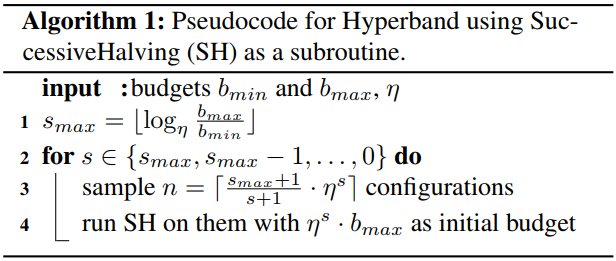
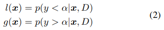
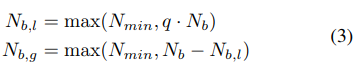
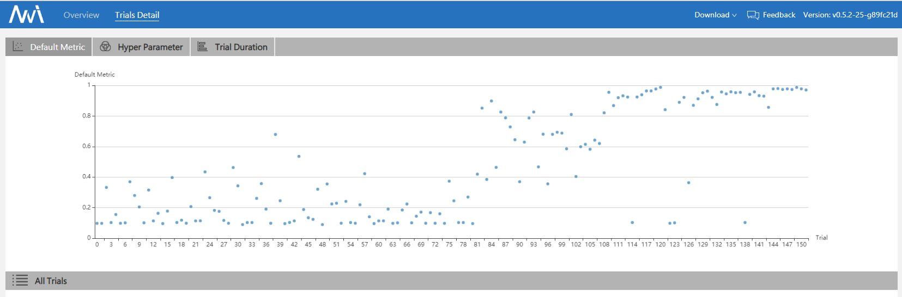

# NNI中的BOHB Advisor

## 1. 介绍

BOHB是由[此篇参考论文](https://arxiv.org/abs/1807.01774)提出的一种高效而稳定的调参算法。 BO 是贝叶斯优化的缩写，HB是强盗算法Hyperband的缩写。

BOHB 依赖 HB（Hyperband）来决定每次跑多少组参数和每组参数分配多少资源（budget），**它的改进之处是它将Hyperband在每个循环开始时随机选择参数的方法替换成了依赖之前的数据建立模型（贝叶斯优化） 进行参数选择**. 一旦贝叶斯优化生成的参数达到迭代所需的配置数, 就会使用这些配置开始执行标准的连续减半过程（successive halving）。 我们观察这些参数在不同资源配置（budget）下的表现g(x, b)，用于在以后的迭代中用作我们贝叶斯优化模型选择参数的基准数据。

接下来我们将份两部分来介绍BOHB过程涉及的原理:

### HB（Hyperband）

我们按照Hyperband 的方式来选择每次跑的参数个数与分配多少资源（budget），并继续使用“连续减半（SuccessiveHalving）”策略，更多有关Hyperband算法的细节，请参考[NNI中的Hyperband](hyperbandAdvisor.md)和[Hyperband 的参考论文](https://arxiv.org/abs/1603.06560)。 下面的伪代码描述了这个过程。



### BO（贝叶斯优化）

BOHB 的 BO 部分与 TPE 非常相似, 它们的主要区别是: BOHB中我们使用一个多维的KDE, 而不是TPE那样带有权重的一维 KDEs, 以便更好地处理搜索空间中超参之间的互相影响。

树形超参评估器 (TPE): 使用 KDE (核密度估计) 来对密度进行建模。



为了建模有效的核密度估计（KDE），我们设置了一个建立模型所需的最小观察点数（Nmin），在我们的实验中它的默认值为d+1（d是搜索空间的维度），其中d也是一个可以设置的超参数。 因为我们希望尽早地建立模型，所以当Nb = |Db|，即当已经观察到的计算资源（budget）为b的点数满足q · Nb ≥ Nmin时，我们立马建立模型来指导之后参数的选择。所以，在我们使用了刚开始Nmin + 2 个随机选择的参数之后，我们会按照下式将我们观察到的点进行分类



按照这个式子将观察到的点分成好的点与坏的点两类，来分别拟合两个不同的密度分布。

注意为了鼓励更多的探索防止陷入局部极小，在建立模型之后我们仍然有**随机比例（random faction）**这样比例的参数是由随机选择生成的。

## 2. 工作流程


以上这张图展示了BOHB的工作流程。 这里我们将每次训练的最大资源配置（max_budget）设为9，最小资源配置设为（min_budget）1，逐次减半比例（eta）设为3，其他的超参数为默认值。 那么在这个例子中，s_max 计算的值为 2, 所以我们会持续地进行{s=2, s=1, s=0, s=2, s=1, s=0, ...} 这样的循环。 在“逐次减半”（SuccessiveHalving）算法的每一个阶段，即图中橙色框，我们都讲选取表现最好的前 1/eta 个参数，并在赋予他们更多计算资源（budget）的情况下让他们运行。我们不断重复“逐次减半” （SuccessiveHalving）过程，直到这个循环结束。 同时，我们将收集这些试验的超参数组合，使用了计算资源（budget）和他们使用了这些资源之后的表现（metrics），使用这些数据来建立一个以使用了多少计算资源（budget）为维度的多维核密度估计（KDE）模型。 这个多维的核密度估计（KDE）模型将用于指导下一个循环的参数选择。

有关我们如何使用多维的KDE模型来指导参数选择的采样规程，我们使用了以下的伪代码来描述这一细节。


## 3. 用法

BOHB advisor的使用依赖[ConfigSpace](https://github.com/automl/ConfigSpace)这个包，在第一次使用BOHB的时候，你可以通过在命令行运行以下的指令来安装要求的ConfigSpace包。

```bash
nnictl package install --name=SMAC
```

要使用 BOHB，需要在 Experiment 的 YAML 配置文件进行如下改动。

```yml
advisor:
  builtinAdvisorName: BOHB
  classArgs:
    optimize_mode: maximize
    min_budget: 1
    max_budget: 27
    eta: 3
    min_points_in_model: 7
    top_n_percent: 15
    num_samples: 64
    random_fraction: 0.33
    bandwidth_factor: 3.0
    min_bandwidth: 0.001
```

**参数**

* **optimize_mode** (*maximize 或 minimize, 可选项, 默认值为 maximize*) - 如果为 'maximize'，表示 Tuner 的目标是将指标最大化。 如果为 'minimize'，表示 Tuner 的目标是将指标最小化。
* **min_budget** (*整数, 可选项, 默认值为 1*) - 运行一个试验给予的最低计算资源（budget），这里的计算资源通常使用mini-batches 或者 epochs。 该参数必须为正数。
* **min_budget** (*整数, 可选项, 默认值为 3*) - 运行一个试验给予的最大计算资源（budget），这里的计算资源通常使用mini-batches 或者 epochs。 该参数必须大于“min_budget”。
* **eta** (*整数, 可选项, 默认值为3*) - 在每次迭代中，执行完整的“连续减半”算法。 在这里，当一个使用相同计算资源的子集结束后，我们会选择表现前 1/eta 好的参数，给予更高的优先级，让他们进入下一轮比较（也就是说会获得更多计算资源）。 该参数必须大于等于2。
* **min_points_in_model**(*整数, 可选项, 默认值为None*): 建立核密度估计（KDE）要求的最小观察到的点。 默认值‘’ None ” 的意思是 dim+1，当在该计算资源（budget）下试验过的参数已经大于等于`max{dim+1, min_points_in_model}`时，BOHB将会开始建立这个计算资源（budget）下对应的核密度估计（KDE）模型，然后用这个模型来指导参数的选取。 该参数必须为正数。（dim指的是搜索空间中超参数的维度）
* **top_n_percent**(*整数, 可选项, 默认值为15*): 认为观察点为好点的百分数(在1到99之间，默认值为15)。 区分表现好的点与表现坏的点是为了建立我们的树形核密度估计模型。 比如，如果你已经观察到了100个点的表现情况，同时把top_n_percent 设置为15，那么表现最好的15个点将会用于创建表现好的点的分布“l（x）”，剩下的85个点将用于创建表现坏的点的分布“g（x）”。
* **num_samples**(*整数, 可选项, 默认值为64*): 用于优化EI值的采样个数（默认值为64）。 在这个例子中，我们将根据l（x）的分布采样“num_samples”（默认值为64）个点。若优化的目标为最大化指标，则会返回其中l(x)/g(x) 的值最大的点作为下一个试验的参数。 否则，我们使用值最小的点。
* **random_fraction**(*浮点数, 可选项, 默认值为0.33*): 使用模型的先验（通常是均匀）来随机采样的比例。
* **bandwidth_factor**(< 1>浮点数, 可选, 默认值为3.0 </em>): 为了鼓励多样性, 我们将会把优化EI的点加宽，即把KDE中采样的点乘以这个因子，从而增加KDE中的带宽。 Suggest to use default value if you are not familiar with KDE.
* **min_bandwidth**(*float, optional, default = 0.001*): to keep diversity, even when all (good) samples have the same value for one of the parameters, a minimum bandwidth (default: 1e-3) is used instead of zero. Suggest to use default value if you are not familiar with KDE.

*Please note that currently float type only support decimal representation, you have to use 0.333 instead of 1/3 and 0.001 instead of 1e-3.*

## 4. File Structure

The advisor has a lot of different files, functions and classes. Here we will only give most of those files a brief introduction:

* `bohb_advisor.py` Defination of BOHB, handle the interaction with the dispatcher, including generating new trial and processing results. Also includes the implementation of HB(Hyperband) part.
* `config_generator.py` includes the implementation of BO(Bayesian Optimization) part. The function *get_config* can generate new configuration base on BO, the function *new_result* will update model with the new result.

## 5. Experiment

### MNIST with BOHB

code implementation: [examples/trials/mnist-advisor](https://github.com/Microsoft/nni/tree/master/examples/trials/)

We chose BOHB to build CNN on the MNIST dataset. The following is our experimental final results:



More experimental result can be found in the [reference paper](https://arxiv.org/abs/1807.01774), we can see that BOHB makes good use of previous results, and has a balance trade-off in exploration and exploitation.