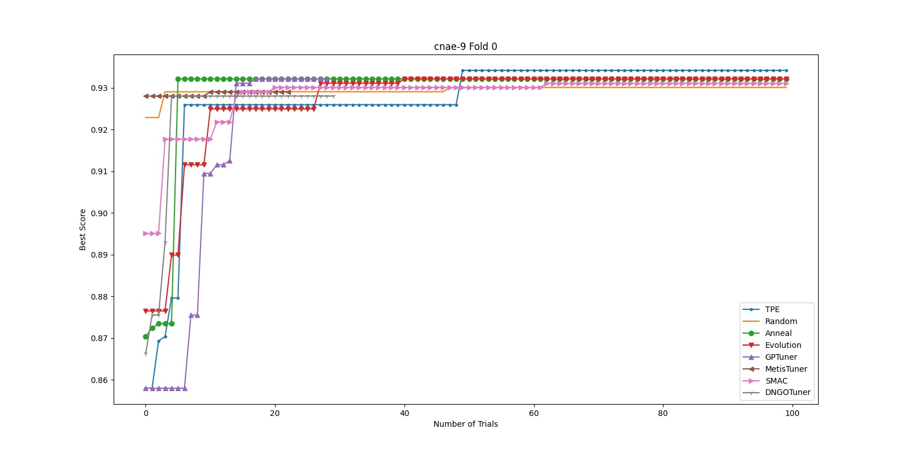
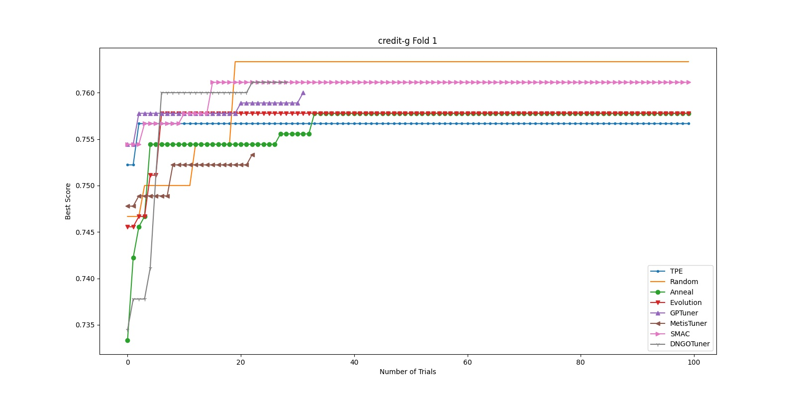
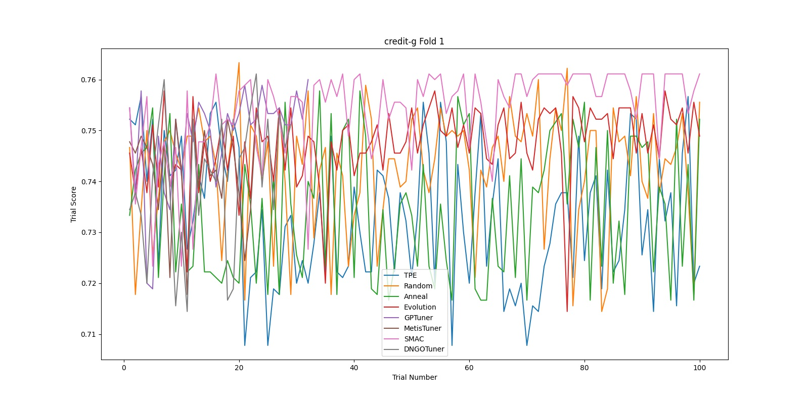
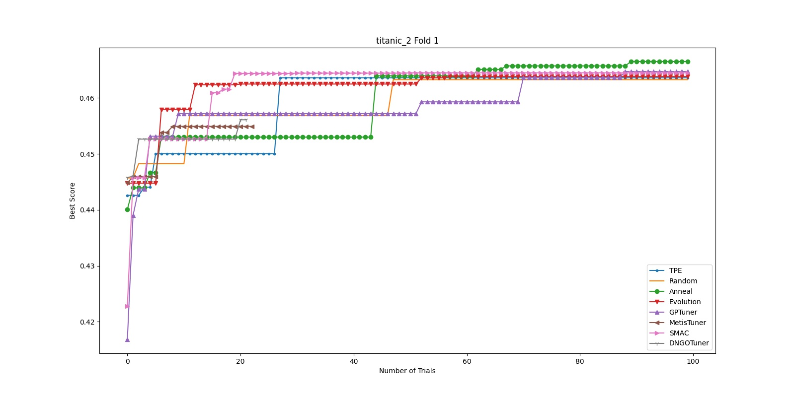

Tuner 基准测试
====================

我们提供了一个基准测试工具来比较 NNI 提供的 Tuner（和用户自定义的 Tuner）在不同任务上的性能。 该工具的实现基于 automlbenchmark 存储库（https://github.com/openml/automlbenchmark），该存储库提供针对由多个 *tasks* 组成的不同 *benchmarks* 运行不同 *frameworks* 的服务。 该工具位于 ``examples/trials/benchmarking/automlbenchmark``。 本文件简要介绍了该工具及其使用方法。 

术语
^^^^^^^^^^^

* **task**\ : 一个任务可以被认为是（数据集，评估器）。 它给出了一个包含（训练、验证、测试）的数据集，评估器根据收到的预测结果评估一个给定的指标（例如，回归的 mse，分类的f1）。 
* **benchmark**\ : 基准测试是一组任务，以及其他外部约束，例如时间和资源。 
* **framework**\ : 给定一个任务，一个框架构思出对所提出的回归或分类问题的答案并产生预测。 请注意，automlbenchmark 框架对框架的假设空间没有任何限制。 在我们在这个文件夹中的实现中，每个框架都是一个元组（tuner，architecture），其中架构提供了假设空间（和 Tuner 的搜索空间），tuner 决定了超参数优化的策略。 
* **tuner**\ : hpo 文件夹中定义的 Tuner 或 Advisor，或用户提供的自定义 Tuner。 
* **architecture**\ : 架构是解决任务的特定方法，以及一组要优化的超参数（即搜索空间）。 在我们的实现中，该架构多次调用 Tuner 以获得可能的超参数配置，并为任务生成最终预测。在我们的实现中，该架构多次调用 Tuner 以获得可能的超参数配置，并为任务生成最终预测。 查看 ``./nni/extensions/NNI/architectures`` 获取示例。

注意：目前，唯一支持的架构是随机森林。 架构实现和搜索空间定义可以在 ``./nni/extensions/NNI/architectures/run_random_forest.py`` 中找到。 基准测试 “nnivalid” 和 “nnismall” 中的任务适合用随机森林解决。 
  
设置
^^^^^

由于 automlbenchmark 和 python 3.8 之间存在一些不兼容，建议使用 python 3.7 运行此文件夹中包含的实验。 首先，运行以下 shell 脚本来克隆 automlbenchmark 存储库。 注意：建议在单独的虚拟环境中执行以下步骤，因为安装代码可能会安装多个包。 

.. code-block:: bash

   ./setup.sh

在现有 Tuner 上运行预定义的基准测试
^^^^^^^^^^^^^^^^^^^^^^^^^^^^^^^^^^^^^^^^^^^^^^^^^^^^^^^^^^^^^^^^^^^^^

.. code-block:: bash

   ./runbenchmark_nni.sh [tuner-names]

该脚本运行基准 “nnivalid”，它由一个回归任务、一个二元分类任务和一个多类分类任务组成。 脚本完成后，您可以在文件夹 results_[time]/reports/ 中找到结果摘要。 要在其他预定义基准上运行，请更改 ``runbenchmark_nni.sh`` 中的 ``benchmark`` 变量。 一些基准在 ``/examples/trials/benchmarking/automlbenchmark/nni/benchmarks``\ 中定义，其他基准测试在 ``/examples/trials/benchmarking/automlbenchmark/automlbenchmark/resources/benchmarks/`` 中定义。 大型基准的一个例子是 "nnismall"，它包括8个回归任务、8个二元分类任务和8个多类分类任务。

默认情况下，该脚本在NNI的所有嵌入式 Tuner 上运行该基准测试。 如果在 [tuner-names] 中提供了一个 Tuner 的列表，它只运行列表中的 Tuner。 目前，支持以下 Tuner："TPE", "Random", "Anneal", "Evolution", "SMAC", "GPTuner", "MetisTuner", "DNGOTuner", "Hyperband", "BOHB"。 也可以评估定制 Tuner。 可参考下一章节。 

默认情况下，该脚本针对指定的基准逐一运行指定的 Tuner。 为了在后台同时运行所有的实验，在 ``runbenchmark_nni.sh`` 中设置 "serialize" 标志为 false。 

注意：SMAC Tuner 、DNGO Tuner 和 BOHB Advisor 必须在运行任何实验之前手动安装。 关于安装SMAC和BOHB的更多细节，请参考 `本页面 <https://nni.readthedocs.io/zh/stable/Tuner/BuiltinTuner.html?highlight=nni>`_ 。

在自定义 Tuner 上运行预定义的基准测试
^^^^^^^^^^^^^^^^^^^^^^^^^^^^^^^^^^^^^^^^^^^^^^^^^^^^^^^^^^^^^^^^^^^^^^^^^^^^^^^^^^^^^^^^

要运行自定义的基准，在 ``./nni/benchmarks`` 文件夹中添加 benchmark_name.yaml 文件，并在 ``runbenchmark_nni.sh`` 中改变 ``benchmark`` 变量。 参见 ``./automlbenchmark/resources/benchmarks/``，了解一些定义自定义基准的例子。

在自定义 Tuner 上运行基准测试
^^^^^^^^^^^^^^^^^^^^^^^^^^^^^^^^^^^^^^^^^^^^^^^^^^^^^^^^^^^^^^

要使用自定义 Tuner，首先要确保 Tuner 继承自 ``nni.tuner.Tuner`` 并正确实现所需的API。 关于实现自定义调谐器的更多信息，请参考 `这里 <https://nni.readthedocs.io/zh/stable/Tuner/CustomizeTuner.html>`_ 。 接下来，执行以下步骤：

#. 用 ``nnictl algo register`` 命令安装自定义 Tuner。 详情请查看 `本文档 <https://nni.readthedocs.io/zh/stable/Tutorial/Nnictl.html>`_ 。 
#. 在 ``./nni/frameworks.yaml``\ 中，添加一个扩展基础框架 NNI 的新框架。 确保参数 ``tuner_type`` 对应于在步骤 1 中安装 Tuner 的 “builtinName”。
#. 运行命令

.. code-block:: bash

      ./runbenchmark_nni.sh new-tuner-builtinName

基准测试示例 
^^^^^^^^^^^^^^^^^^^^^^^^^^^^^^^^^^^^^^

例如，我们在以下8个 Tuner 上运行 “nnismall” 基准： "TPE", "Random", "Anneal", "Evolution", "SMAC", "GPTuner", "MetisTuner", "DNGOTuner". 由于一些任务包含相当数量的训练数据，在一个 Tuner 上使用单个 CPU 核心运行整个基准测试大约需要2天。 关于任务的详细描述，请查看 ``/examples/trials/benchmarking/automlbenchmark/nni/benchmarks/nnismall_description.txt`` 。 对于二类和多类分类任务，使用了 "AUC "和 "logloss" 指标进行评估，而对于回归，则使用了 "r2" 和 "rmse" 指标。 

脚本完成后，每个 Tuner 的最终得分被总结在文件中 ``results[time]/reports/performances.txt``。 由于该文件很大，我们只显示以下屏幕截图并总结其他重要统计数据。 

.. image:: ../img/hpo_benchmark/performances.png
   :target: ../img/hpo_benchmark/performances.png
   :alt: 

此外，在对结果进行解析时，根据最终的性能对 Tuner 进行排名。 ``results[time]/reports/rankings.txt`` 显示了在每个指标（logloss, rmse, auc）下，Tuner 的平均排名。 在这里，我们介绍了前三个表中的数据。 此外，对于每个 Tuner，我们总结了对每种类型度量的性能（相同数据的另一视图）。 我们在第四个表格中介绍了这一统计数据。 

指标 rmse 的平均排名：

.. list-table::
   :header-rows: 1

   * - Tuner 名字
     - 平均排名
   * - Anneal
     - 3.75
   * - Random
     - 4.00
   * - Evolution
     - 4.44
   * - DNGOTuner
     - 4.44
   * - SMAC
     - 4.56
   * - TPE
     - 4.94
   * - GPTuner
     - 4.94
   * - MetisTuner
     - 4.94

指标 auc 的平均排名：

.. list-table::
   :header-rows: 1

   * - Tuner 名字
     - 平均排名
   * - SMAC
     - 3.67
   * - GPTuner
     - 4.00
   * - Evolution
     - 4.22
   * - Anneal
     - 4.39
   * - MetisTuner
     - 4.39
   * - TPE
     - 4.67
   * - Random
     - 5.33
   * - DNGOTuner
     - 5.33

指标 logloss 的平均排名：

.. list-table::
   :header-rows: 1

   * - Tuner 名字
     - 平均排名
   * - Random
     - 3.36
   * - DNGOTuner
     - 3.50
   * - SMAC
     - 3.93
   * - GPTuner
     - 4.64
   * - TPE
     - 4.71
   * - Anneal
     - 4.93
   * - Evolution
     - 5.00
   * - MetisTuner
     - 5.93

Tuner 的平均排名：

.. list-table::
   :header-rows: 1

   * - Tuner 名字
     - rmse
     - auc
     - logloss
   * - TPE
     - 4.94
     - 4.67
     - 4.71
   * - Random
     - 4.00
     - 5.33
     - 3.36
   * - Anneal
     - 3.75
     - 4.39
     - 4.93
   * - Evolution
     - 4.44
     - 4.22
     - 5.00
   * - GPTuner
     - 4.94
     - 4.00
     - 4.64
   * - MetisTuner
     - 4.94
     - 4.39
     - 5.93
   * - SMAC
     - 4.56
     - 3.67
     - 3.93
   * - DNGOTuner
     - 4.44
     - 5.33
     - 3.50

除了这些报告，我们的脚本还为每个任务的每个文件夹生成两个图表。 第一个图表显示了每个 Tuner 在第 x 个 Trial 之前的最佳分数，第二图表显示了 Trial x 中每个 Tuner 的分数。 这两张图可以提供一些关于 Tuner 如何 "收敛" 的信息。 我们发现，对于 "nnismall"，随机森林模型上的 Tuner，其搜索空间定义在 ``/examples/trials/benchmarking/automlbenchmark/nni/extensions/NNI/architectures/run_random_forest.py`` ，一般在40到60次试验后收敛到最终解决方案。 由于图表太多，无法包含在一份报告中（共96张图表），我们在此只介绍10张图表。

.. image:: ../img/hpo_benchmark/car_fold1_1.jpg
   :target: ../img/hpo_benchmark/car_fold1_1.jpg
   :alt: 

.. image:: ../img/hpo_benchmark/car_fold1_2.jpg
   :target: ../img/hpo_benchmark/car_fold1_2.jpg
   :alt: 

例如，前面两个图是为任务 "汽车" 的文件夹1生成的。 在第一张图中，我们可以观察到，大多数 Tuner 在40次 Trial 中找到了一个相对较好的解决方案。 在这个实验中，在所有的 Tuner 中，DNGOTuner 最快收敛到最佳解决方案（在10次 Trial 内）。 它的分数在整个实验中提高了三次。 在第二张图中，我们观察到大多数 Tuner 的分数在整个实验期间都在0.8和1之间波动。 然而，似乎 Anneal 调谐器（绿线）更不稳定（有更多的波动），而 GPTune r有一个更稳定的模式。 无论如何，虽然这种模式可以在某种程度上被解释为 Tuner 对探索开采权衡的位置，但它不能用于综合评估 Tuner 的效率。 

.. image:: ../img/hpo_benchmark/christine_fold0_1.jpg
   :target: ../img/hpo_benchmark/christine_fold0_1.jpg
   :alt: 

.. image:: ../img/hpo_benchmark/christine_fold0_2.jpg
   :target: ../img/hpo_benchmark/christine_fold0_2.jpg
   :alt: 

.. image:: ../img/hpo_benchmark/cnae-9_fold0_2.jpg
   :target: ../img/hpo_benchmark/cnae-9_fold0_2.jpg
   :alt: 

.. image:: ../img/hpo_benchmark/titanic_2_fold1_2.jpg
   :target: ../img/hpo_benchmark/titanic_2_fold1_2.jpg
   :alt: 

