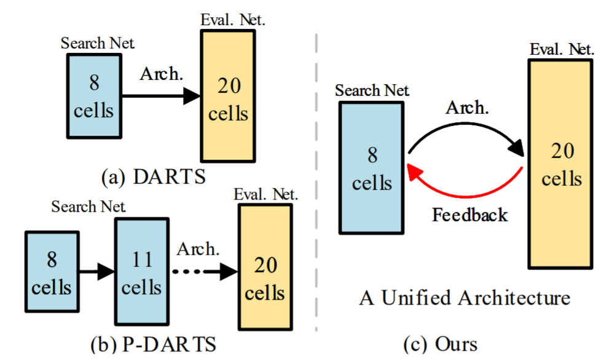
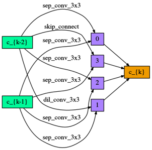
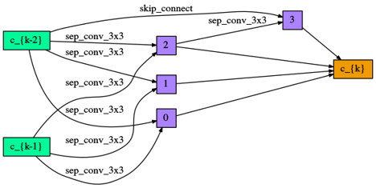
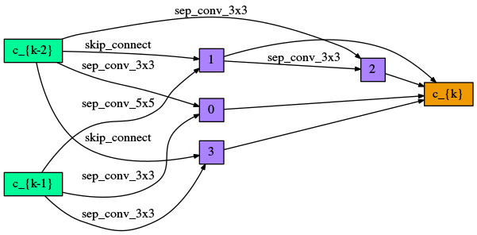

# Cyclic Differentiable Architecture Search
This is CDARTS based on the NNI platform, which currently supports CIFAR10 search and retrain. ImageNet search and retrain should also be supported, and we provide corresponding interfaces. Our reproduced results on NNI are slightly lower than the paper, but much higher than the original DARTS.

<div align="center">
  
  <!-- <p>framework1.</p> -->
</div>

## Results
#### Main CIFAR10 top1 accuracy of DARTS and DARTS reproduced by NNI
| Order | Paper | NNI | 
| ---- |:-------------:| :-----:|
| 1 | 97.00 +/-0.14 | 97.22 |
| 2 | 97.24 +/-0.09 | 97.11 |

#### Main CIFAR10 top1 accuracy of CDARTS and CDARTS reproduced by NNI
| Runs | Paper | NNI | 
| ---- |:-------------:| :-----:|
| 1 | 97.52 | 97.43 |
| 2 | 97.53 | 97.46 |
| 3 | 97.58 | 97.47 |

### The normal cells searched by CDARTS(NNI) on CIFAR10
<div align="center">
  
  <!-- <p>cell.</p> -->
</div>

<div align="center">
  
  
  <!-- <p>cell.</p> -->
</div>


## Environments
Tesla V100, CUDA10.0, linux 16.04, pytorch>=1.2, python3, [apex](https://github.com/NVIDIA/apex) and NNI 1.3

## Data Preparation
* [Cifar-10](https://www.cs.toronto.edu/~kriz/cifar.html)
* [Cifar-100](https://www.cs.toronto.edu/~kriz/cifar.html)
* [ImageNet-2012](http://www.image-net.org/)

Create soft link in main dir.
```
ln -s $DataLocation data
```

## Installation
* First, install python requirements.
    ```buildoutcfg
    pip install torch==1.2.0
    pip install tensorboard==1.13.0
    pip install tensorboardX==1.6
    pip install nni==1.3.0
    ```
* Then, you should install apex.
    ```buildoutcfg
    git clone https://github.com/NVIDIA/apex
    cd apex
    python setup.py install --cpp_ext --cuda_ext
    ```

## Search and Retrain
### Search
* Main python file is ${ROOT}/search.py
* Followings are options during training.
    ```buildoutcfg
    --regular_ratio             # if use regular, the ragular ratio
    --regular_coeff             # if use regular, the regular coefficient
    --loss_alpha                # the loss coefficient
    --loss_T                    # the loss coefficient
    --w_lr                      # the learning rate of the search network
    --alpha_lr                  # the learning rate of the architecture parameters
    --nasnet_lr                 # the learning rate of the evaluation network
    --w_weight_decay            # the weight decay the search and the evaluation network
    --alpha_weight_decay        # the weight decay the the architecture parameters
    --fix_head                  # wheter to fix the paramters of auxiliary heads
    --interactive_type          # The KD function, kl and smoothl1
    --share_module              # Whether to share module of the two networks
    --warmup_epochs             # the epochs to warmup the search network
    --epochs                    # total epochs of search

    ```
* Here we present our search scripts on CIFAR10.
    ```buildoutcfg
    bash run_search_cifar.sh
    ```


### Retrain
* Main python file is ${ROOT}/retrain.py
* Followings are options during training.
    ```buildoutcfg
    --arc_checkpoint            # choose which genotype to retrain
    --cell_file                 # path of cell genotype
    --weight_decay              # decay of W in the Retrain-Phase
    --lr                        # learning rate of W in the Retrain-Phase
    --warmup_epochs             # warmup epochs 
    --epochs                    # total retrain epochs 
    --cutout_length             # cutout length for cifar
    --aux_weight                # weight of auxiliary loss, 0.4 is the best option   
    --drop_path_prob            # used for dropping path in NAS
    --label_smooth              # label smooth ratio
    --mixup_alpha               # ratio of mixup
    ```
* Here we present our train scripts on CIFAR10.
    ```buildoutcfg
    bash run_retrain_cifar.sh
    ```
