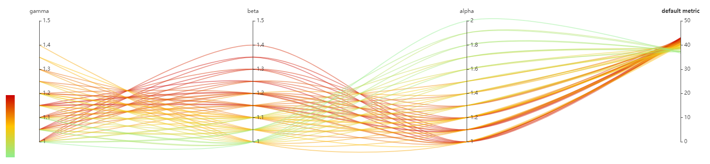

# EfficientNet

[EfficientNet: Rethinking Model Scaling for Convolutional Neural Networks](https://arxiv.org/abs/1905.11946)

Provided here are:

* Search space and tuners for finding the best tuple (alpha, beta, gamma) for EfficientNet-B1 with grid search, as discussed in Section 3.3 in [paper](https://arxiv.org/abs/1905.11946).
* Search space for EfficientNet transfer learning on datasets other than ImageNet; settings are borrowed from Appendix A.5 from "[Do Better ImageNet Models Transfer Better?](https://arxiv.org/abs/1805.08974)".

## Instructions

1. Run `git clone https://github.com/ultmaster/EfficientNet-PyTorch` to clone this modified version of [EfficientNet-PyTorch](https://github.com/lukemelas/EfficientNet-PyTorch). The modifications were done to adhere to the original [Tensorflow version](https://github.com/tensorflow/tpu/tree/master/models/official/efficientnet) as close as possible (including EMA, label smoothing and etc.); also added are the part which gets parameters from tuner and reports intermediate/final results. Clone it into `EfficientNet-PyTorch`; the files like `main.py`, `train_imagenet.sh` will appear inside, as specified in the configuration files.
2. Run `nnictl create --config config_lr.yml` in case of transfer learning; or `nnictl create --config config_net.yml` to find the best EfficientNet-B1. Adjust the training service (PAI/local/remote), batch size in the config files according to the environment.

For training on ImageNet, read `EfficientNet-PyTorch/train_imagenet.sh`. Download ImageNet beforehand and extract it adhering to [PyTorch format](https://pytorch.org/docs/stable/torchvision/datasets.html#imagenet) and then replace `/mnt/data/imagenet` in with the location of the ImageNet storage. This file should also be a good example to follow for mounting ImageNet into the container on OpenPAI.

*Backward compatibility instructions: Grid Search quniform is changed in NNI v1.0. Use `search_net_old.json` if for NNI <= 0.9.* 

## Results

The follow image is a screenshot, demonstrating the relationship between acc@1 and alpha, beta, gamma.

