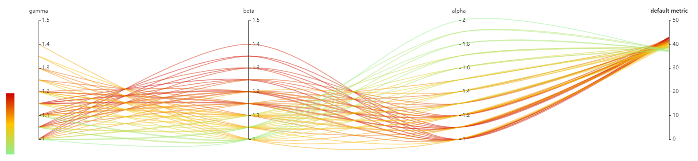

# EfficientNet

[EfficientNet: 重新思考卷积神经网络的模型尺度](https://arxiv.org/abs/1905.11946)

这里提供了：使用遍历搜索为 EfficientNet-B1 找到最佳元组（alpha，beta，gamma）的搜索空间和 Tuner。参考[论文](https://arxiv.org/abs/1905.11946)的 3.3 章。

## 说明

1. 设置此目录为当前目录。
2. 运行 `git clone https://github.com/ultmaster/EfficientNet-PyTorch` 来 clone 修改过的 [EfficientNet-PyTorch](https://github.com/lukemelas/EfficientNet-PyTorch)。 The modifications were done to adhere to the original [Tensorflow version](https://github.com/tensorflow/tpu/tree/master/models/official/efficientnet) as close as possible (including EMA, label smoothing and etc.); also added are the part which gets parameters from tuner and reports intermediate/final results. Clone it into `EfficientNet-PyTorch`; the files like `main.py`, `train_imagenet.sh` will appear inside, as specified in the configuration files.
3. Run `nnictl create --config config_net.yml` to find the best EfficientNet-B1. Adjust the training service (PAI/local/remote), batch size in the config files according to the environment.

For training on ImageNet, read `EfficientNet-PyTorch/train_imagenet.sh`. Download ImageNet beforehand and extract it adhering to [PyTorch format](https://pytorch.org/docs/stable/torchvision/datasets.html#imagenet) and then replace `/mnt/data/imagenet` in with the location of the ImageNet storage. This file should also be a good example to follow for mounting ImageNet into the container on OpenPAI.

## Results

The follow image is a screenshot, demonstrating the relationship between acc@1 and alpha, beta, gamma.

