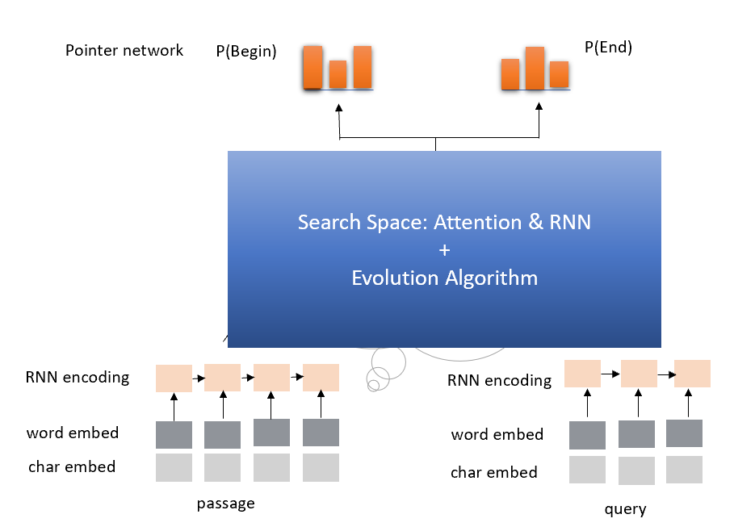

# Automatic Model Architecture Search for Reading Comprehension
This example shows us how to use Genetic Algorithm to find good model architectures for Reading Comprehension task.

## Search Space
Since attention and recurrent neural network (RNN) module have been proven effective in Reading Comprehension.
We conclude the search space as follow:

1. IDENTITY (Effectively means keep training).
2. INSERT-RNN-LAYER (Inserts a LSTM. Comparing the performance of GRU and LSTM in our experiment, we decided to use LSTM here.)
3. REMOVE-RNN-LAYER
4. INSERT-ATTENTION-LAYER(Inserts a attention layer.)
5. REMOVE-ATTENTION-LAYER
6. ADD-SKIP (Identity between random layers).
7. REMOVE-SKIP (Removes random skip).



## New version
Also we have another version which time cost is less and performance is better. We will release soon.

# How to run this example?

## Use downloading script to download data

Execute the following command to download needed files
using the downloading script:

```
chmod +x ./download.sh
./download.sh
```

## Download manually

1. download "dev-v1.1.json" and "train-v1.1.json" in https://rajpurkar.github.io/SQuAD-explorer/

```
wget https://rajpurkar.github.io/SQuAD-explorer/dataset/train-v1.1.json
wget https://rajpurkar.github.io/SQuAD-explorer/dataset/dev-v1.1.json
```

2. download "glove.840B.300d.txt" in https://nlp.stanford.edu/projects/glove/

```
wget http://nlp.stanford.edu/data/glove.840B.300d.zip
unzip glove.840B.300d.zip
```

# submit this job
```
nnictl create --config ~/nni/examples/trials/ga_squad/config.yaml
```
