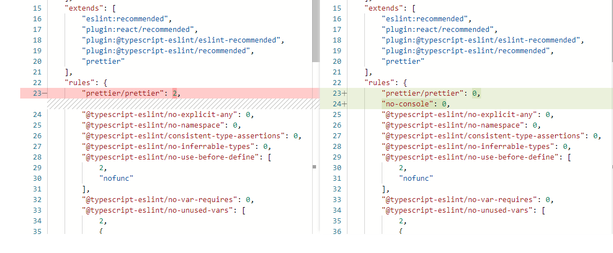

# WebUI

WebUI is built by using [React](https://reactjs.org/docs/getting-started.html) and [fluentui](https://developer.microsoft.com/en-us/fluentui#/controls/web).


## Development

* Please refer the [installation doc](https://github.com/microsoft/nni#installation) to run an experiment.
* WebUI uses [eslint](https://eslint.org/docs/user-guide/getting-started) and [prettier](https://prettier.io/docs/en/index.html) to format code. You could change the eslintrc file like this picture when you are coding.



* Use this command in `webui/ts` directory when you want to see latest website.
    ```bash
    yarn build
    ```

## PR

* If you need to send the PR, you should change the eslintrc file back and use the command `yarn eslint` to check   style. And `yarn eslint --fix` could fix almost warnings and errors. Also use `yarn stylelint` to confirm `.scss & .css` style.