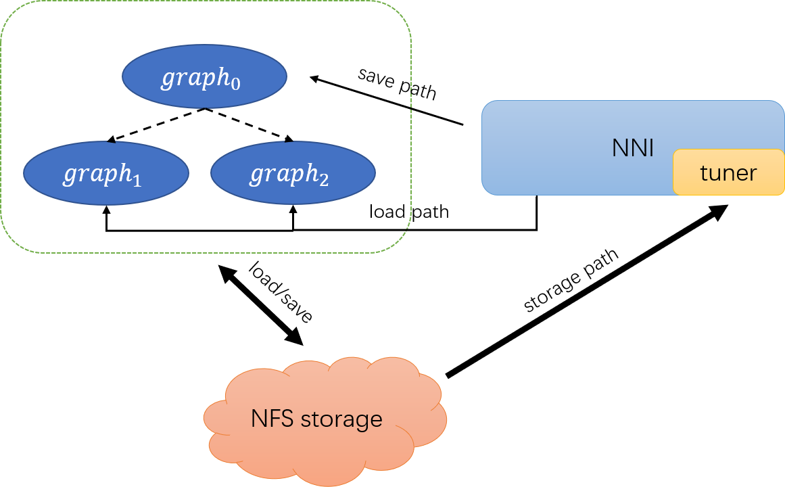

# 高级神经网络架构搜索教程

目前，许多 NAS（Neural Architecture Search，神经网络架构搜索）算法都在尝试上使用了 **权重共享（weight sharing）** 的方法来加速训练过程。 例如，[ENAS](https://arxiv.org/abs/1802.03268) 与以前的 [NASNet](https://arxiv.org/abs/1707.07012) 算法相比，通过'*子模型间的参数共享（parameter sharing between child models）*'提高了 1000 倍的效率。 而例如 [DARTS](https://arxiv.org/abs/1806.09055), [Network Morphism](https://arxiv.org/abs/1806.10282), 和 [Evolution](https://arxiv.org/abs/1703.01041) 等算法也利用或者隐式的利用了权重共享。

这是关于如何在 NNI 中启用权重共享的教程。

## 尝试间的权重共享

目前，推荐通过 NFS （Network File System）来进行权重共享，它是轻量、相对高效的多机共享文件方案。 欢迎社区来共享更多高效的技术。

### 通过 NFS 文件的权重共享

使用 NFS 配置（见下文），尝试代码可以通过读写文件来共享模型权重。 建议使用调参器的存储路径：

```yaml
tuner:
  codeDir: path/to/customer_tuner
  classFileName: customer_tuner.py 
  className: CustomerTuner
  classArgs:
    ...
    save_dir_root: /nfs/storage/path/
```

And let tuner decide where to save & load weights and feed the paths to trials through `nni.get_next_parameters()`:



For example, in tensorflow:

```python
# save models
saver = tf.train.Saver()
saver.save(sess, os.path.join(params['save_path'], 'model.ckpt'))
# load models
tf.init_from_checkpoint(params['restore_path'])
```

where `'save_path'` and `'restore_path'` in hyper-parameter can be managed by the tuner.

### NFS Setup

In NFS, files are physically stored on a server machine, and trials on the client machine can read/write those files in the same way that they access local files.

#### Install NFS on server machine

First, install NFS server:

```bash
sudo apt-get install nfs-kernel-server
```

Suppose `/tmp/nni/shared` is used as the physical storage, then run:

```bash
sudo mkdir -p /tmp/nni/shared
sudo echo "/tmp/nni/shared *(rw,sync,no_subtree_check,no_root_squash)" >> /etc/exports
sudo service nfs-kernel-server restart
```

You can check if the above directory is successfully exported by NFS using `sudo showmount -e localhost`

#### Install NFS on client machine

First, install NFS client:

```bash
sudo apt-get install nfs-common
```

Then create & mount the mounted directory of shared files:

```bash
sudo mkdir -p /mnt/nfs/nni/
sudo mount -t nfs 10.10.10.10:/tmp/nni/shared /mnt/nfs/nni
```

where `10.10.10.10` should be replaced by the real IP of NFS server machine in practice.

## Asynchornous Dispatcher Mode for trial dependency control

The feature of weight sharing enables trials from different machines, in which most of the time **read after write** consistency must be assured. After all, the child model should not load parent model before parent trial finishes training. To deal with this, users can enable **asynchronous dispatcher mode** with `multiThread: true` in `config.yml` in NNI, where the dispatcher assign a tuner thread each time a `NEW_TRIAL` request comes in, and the tuner thread can decide when to submit a new trial by blocking and unblocking the thread itself. For example:

```python
    def generate_parameters(self, parameter_id):
        self.thread_lock.acquire()
        indiv = # configuration for a new trial
        self.events[parameter_id] = threading.Event()
        self.thread_lock.release()
        if indiv.parent_id is not None:
            self.events[indiv.parent_id].wait()

    def receive_trial_result(self, parameter_id, parameters, reward):
        self.thread_lock.acquire()
        # code for processing trial results
        self.thread_lock.release()
        self.events[parameter_id].set()
```

## Examples

For details, please refer to this [simple weight sharing example](../test/async_sharing_test). We also provided a [practice example](../examples/trials/weight_sharing/ga_squad) for reading comprehension, based on previous [ga_squad](../examples/trials/ga_squad) example.