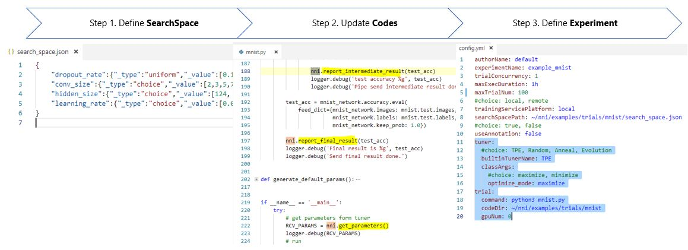
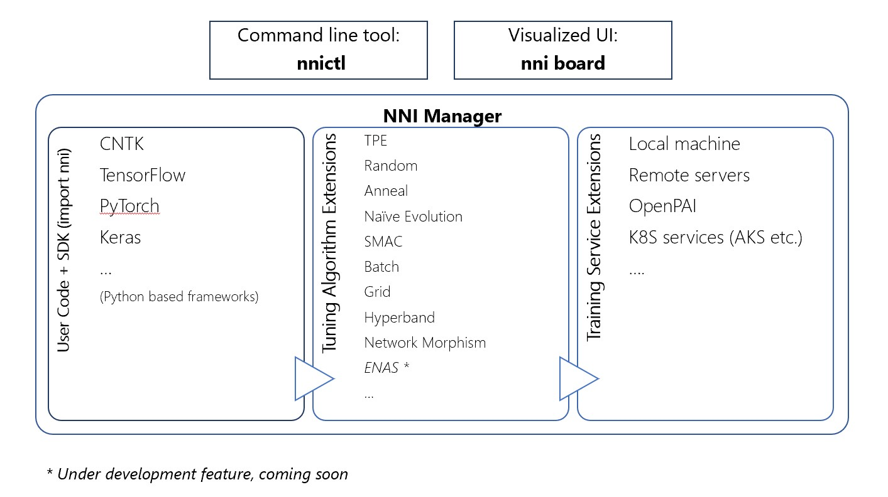

# NNI 概述

NNI (Neural Network Intelligence) 是自动机器学习（AutoML）实验的工具包。 每次实验，用户只需要定义搜索空间，改动几行代码，就能利用 NNI 内置的算法和训练服务来搜索最好的超参组合以及神经网络结构。

> 第一步：[定义搜索空间](SearchSpaceSpec.md)
> 
> 第二步：[改动模型代码](howto_1_WriteTrial.md)
> 
> 第三步：[定义实验配置](ExperimentConfig.md)

用户通过命令行工具 [nnictl](../tools/README.md) 创建实验后，守护进程（NNI 管理器）会开始搜索过程。 NNI 管理器不断地通过搜索配置的优化算法来生成参数配置，并通过训练服务组件，在目标训练环境中（例如：本机、远程服务器、云服务等），来调度并运行尝试的任务。 尝试任务的模型精度等结果会返回给优化算法，以便生成更好的参数配置。 NNI 管理器会在找到最佳模型后停止搜索过程。

## 体系结构概述

用户可以用 nnictl 或可视化的 WEB 界面 NNIBoard 来查看并调试指定的实验。

NNI provides a set of examples in the package to get you familiar with the above process. In the following example [/examples/trials/mnist], we had already set up the configuration and updated the training codes for you. You can directly run the following command to start an experiment.

## 主要概念

**Experiment（实验）**，在 NNI 中是通过 Trial（尝试）在给定的条件来测试不同的假设情况。 在实验过程中，会有条理的修改一个或多个条件，以便测试它们对相关条件的影响。

### **Trial（尝试）**

**Trial（尝试）**是将一组参数在模型上独立的一次尝试。

### **Tuner（调参器）**

**Tuner（调参器）**，在 NNI 中是实现了调参器 API 的某个超参调优算法。 [了解 NNI 中最新内置的调参器](HowToChooseTuner.md)

### **Assessor（评估器）**

**Assessor（评估器）**，实现了评估器 API，用来加速实验执行过程。

## 了解更多信息

* [开始使用](GetStarted.md)
* [安装 NNI](Installation.md)
* [使用命令行工具 nnictl](NNICTLDOC.md)
* [使用 NNIBoard](WebUI.md)
* [使用标记](howto_1_WriteTrial.md#nni-python-annotation)

### **教程**

* [如何在本机运行实验 (支持多 GPU 卡)？](tutorial_1_CR_exp_local_api.md)
* [如何在多机上运行实验？](tutorial_2_RemoteMachineMode.md)
* [如何在 OpenPAI 上运行实验？](PAIMode.md)