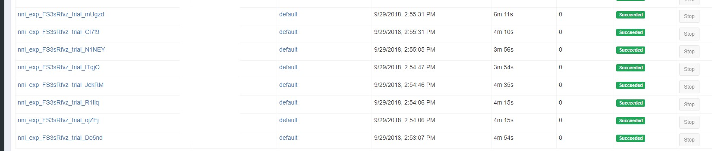

# **在 OpenPAI 上运行实验**

NNI 支持在 [OpenPAI](https://github.com/Microsoft/pai) （简称 pai）上运行实验，即 pai 模式。 在使用 NNI 的 pai 模式前, 需要有 [OpenPAI](https://github.com/Microsoft/pai) 群集的账户。 如果没有 OpenPAI 账户，参考[这里](https://github.com/Microsoft/pai#how-to-deploy)来进行部署。 在 pai 模式中，会在 Docker 创建的容器中运行尝试程序。

## 设置环境

参考[指南](GetStarted.md)安装 NNI。

## 运行实验

以 `examples/trials/mnist-annotation` 为例。 NNI 的 yaml 配置文件如下：

    authorName: your_name
    experimentName: auto_mnist
    # 并发运行的尝试数量
    trialConcurrency: 2
    # 实验的最长持续运行时间
    maxExecDuration: 3h
    # 空表示一直运行
    maxTrialNum: 100
    # 可选项: local, remote, pai
    trainingServicePlatform: pai
    # 可选项: true, false  
    useAnnotation: true
    tuner:
      builtinTunerName: TPE
      classArgs:
        optimize_mode: maximize
    trial:
      command: python3 mnist.py
      codeDir: ~/nni/examples/trials/mnist-annotation
      gpuNum: 0
      cpuNum: 1
      memoryMB: 8196
      image: openpai/pai.example.tensorflow
      dataDir: hdfs://10.1.1.1:9000/nni
      outputDir: hdfs://10.1.1.1:9000/nni
    # 配置访问的 OpenPAI 集群
    paiConfig:
      userName: your_pai_nni_user
      passWord: your_pai_password
      host: 10.1.1.1
    

注意：如果用 pai 模式运行，需要在 yaml 文件中设置 `trainingServicePlatform: pai`。

与本机模式，以及[远程计算机模式](RemoteMachineMode.md)相比，pai 模式的尝试有额外的配置：

* cpuNum 
    * 必填。 尝试程序的 CPU 需求，必须为正数。
* memoryMB 
    * 必填。 尝试程序的内存需求，必须为正数。
* image 
    * 必填。 在 pai 模式中，尝试程序由 OpenPAI 在 [Docker 容器](https://www.docker.com/)中安排运行。 此键用来指定尝试程序的容器使用的 Docker 映像。 
    * [Docker Hub](https://hub.docker.com/) 上有预制的 NNI Docker 映像 [nnimsra/nni](https://hub.docker.com/r/msranni/nni/)。 它包含了用来启动 NNI 实验所依赖的所有 Python 包，Node 模块和 JavaScript。 用来生成此映像的文件在[这里](../deployment/Dockerfile.build.base)。 可以直接使用此映像，或参考它来生成自己的映像。
* dataDir 
    * 可选。 指定了尝试用于下载数据的 HDFS 数据目录。 格式应为 hdfs://{your HDFS host}:9000/{数据目录}
* outputDir 
    * 可选。 指定了尝试的 HDFS 输出目录。 尝试在完成（成功或失败）后，尝试的 stdout， stderr 会被 NNI 自动复制到此目录中。 格式应为 hdfs://{your HDFS host}:9000/{输出目录}

完成并保存 NNI 实验配置文件后（例如可保存为：exp_pai.yaml），运行以下命令：

    nnictl create --config exp_pai.yaml
    

来在 pai 模式下启动实验。 NNI 会为每个尝试创建 OpenPAI 作业，作业名称的格式为 `nni_exp_{experiment_id}_trial_{trial_id}`。 可以在 OpenPAI 集群的网站中看到 NNI 创建的作业，例如： 

Notice: In pai mode, NNIManager will start a rest server and listen on a port which is your NNI WebUI's port plus 1. For example, if your WebUI port is `8080`, the rest server will listen on `8081`, to receive metrics from trial job running in Kubernetes. So you should `enable 8081` TCP port in your firewall rule to allow incoming traffic.

Once a trial job is completed, you can goto NNI WebUI's overview page (like http://localhost:8080/oview) to check trial's information.

Expand a trial information in trial list view, click the logPath link like: 

And you will be redirected to HDFS web portal to browse the output files of that trial in HDFS: 

You can see there're three fils in output folder: stderr, stdout, and trial.log

If you also want to save trial's other output into HDFS, like model files, you can use environment variable `NNI_OUTPUT_DIR` in your trial code to save your own output files, and NNI SDK will copy all the files in `NNI_OUTPUT_DIR` from trial's container to HDFS.

Any problems when using NNI in pai mode, plesae create issues on [NNI github repo](https://github.com/Microsoft/nni), or send mail to nni@microsoft.com