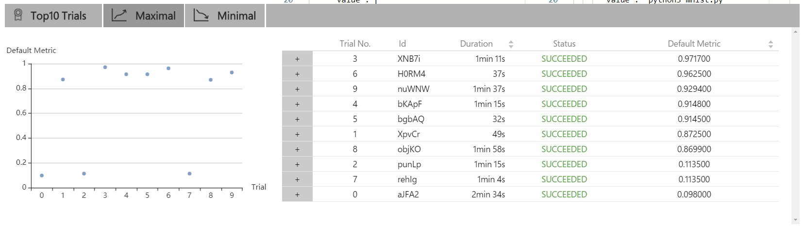
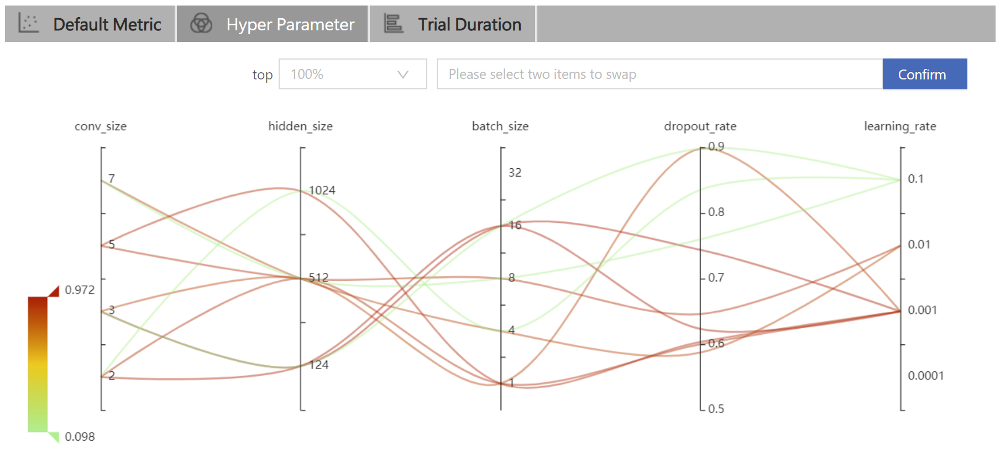
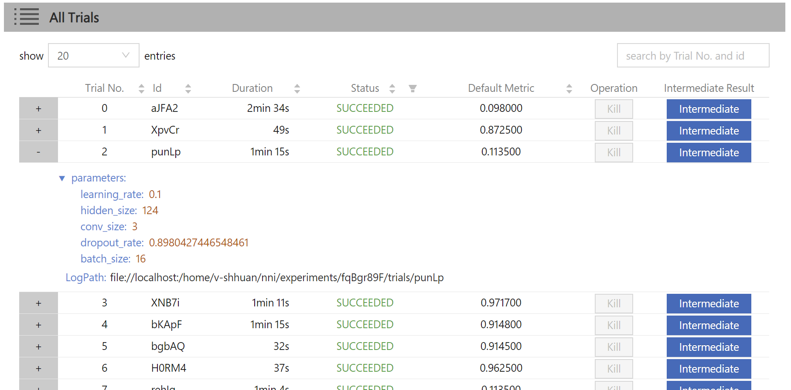

# 快速入门

## 安装

当前支持 Linux 和 MacOS。测试并支持的版本包括：Ubuntu 16.04 及更高版本，MacOS 10.14.1。 在 `python >= 3.5` 的环境中，只需要运行 `pip install` 即可完成安装。

```bash
    python3 -m pip install --upgrade nni
```

注意：

* 如果需要将 NNI 安装到自己的 home 目录中，可使用 `--user`，这样也不需要任何特殊权限。
* 如果遇到如`Segmentation fault` 这样的任何错误请参考[常见问题](FAQ.md)。
* 参考[安装 NNI](Installation.md)，来了解`系统需求`。

## MNIST 上的 "Hello World"

NNI 是一个能进行自动机器学习实验的工具包。 它可以自动进行获取超参、运行 Trial，测试结果，调优超参的循环。 下面会展示如何使用 NNI 来找到最佳超参组合。

这是还**没有 NNI** 的样例代码，用 CNN 在 MNIST 数据集上训练：

```python
def run_trial(params):
    # 输入数据
    mnist = input_data.read_data_sets(params['data_dir'], one_hot=True)
    # 构建网络
    mnist_network = MnistNetwork(channel_1_num=params['channel_1_num'], channel_2_num=params['channel_2_num'], conv_size=params['conv_size'], hidden_size=params['hidden_size'], pool_size=params['pool_size'], learning_rate=params['learning_rate'])
    mnist_network.build_network()

    test_acc = 0.0
    with tf.Session() as sess:
        # 训练网络
        mnist_network.train(sess, mnist)
        # 评估网络
        test_acc = mnist_network.evaluate(mnist)

if __name__ == '__main__':
    params = {'data_dir': '/tmp/tensorflow/mnist/input_data', 'dropout_rate': 0.5, 'channel_1_num': 32, 'channel_2_num': 64, 'conv_size': 5, 'pool_size': 2, 'hidden_size': 1024, 'learning_rate': 1e-4, 'batch_num': 2000, 'batch_size': 32}
    run_trial(params)
```

注意：完整实现请参考 [examples/trials/mnist/mnist_before.py](https://github.com/Microsoft/nni/tree/master/examples/trials/mnist/mnist_before.py)

上面的代码一次只能尝试一组参数，如果想要调优学习率，需要手工改动超参，并一次次尝试。

NNI 就是用来帮助调优工作的。它的工作流程如下：

    输入: 搜索空间, Trial 代码, 配置文件
    输出: 一组最佳的超参配置
    
    1: For t = 0, 1, 2, ..., maxTrialNum,
    2:      hyperparameter = 从搜索空间选择一组参数
    3:      final result = run_trial_and_evaluate(hyperparameter)
    4:      返回最终结果给 NNI
    5:      If 时间达到上限,
    6:          停止实验
    7: return 最好的实验结果
    

如果需要使用 NNI 来自动训练模型，找到最佳超参，需要如下三步：

**使用 NNI 时的三个步骤**

**第一步**：定义 JSON 格式的`搜索空间`文件，包括所有需要搜索的超参的`名称`和`分布`（离散和连续值均可）。

```diff
-   params = {'data_dir': '/tmp/tensorflow/mnist/input_data', 'dropout_rate': 0.5, 'channel_1_num': 32, 'channel_2_num': 64,
-   'conv_size': 5, 'pool_size': 2, 'hidden_size': 1024, 'learning_rate': 1e-4, 'batch_num': 2000, 'batch_size': 32}
+ {
+     "dropout_rate":{"_type":"uniform","_value":[0.5, 0.9]},
+     "conv_size":{"_type":"choice","_value":[2,3,5,7]},
+     "hidden_size":{"_type":"choice","_value":[124, 512, 1024]},
+     "batch_size": {"_type":"choice", "_value": [1, 4, 8, 16, 32]},
+     "learning_rate":{"_type":"choice","_value":[0.0001, 0.001, 0.01, 0.1]}
+ }
```

*实现代码：[search_space.json](https://github.com/Microsoft/nni/tree/master/examples/trials/mnist/search_space.json)*

**第二步**：修改 `Trial` 代码来从 NNI 获取超参，并返回 NNI 最终结果。

```diff
+ import nni

  def run_trial(params):
      mnist = input_data.read_data_sets(params['data_dir'], one_hot=True)

      mnist_network = MnistNetwork(channel_1_num=params['channel_1_num'], channel_2_num=params['channel_2_num'], conv_size=params['conv_size'], hidden_size=params['hidden_size'], pool_size=params['pool_size'], learning_rate=params['learning_rate'])
      mnist_network.build_network()

      with tf.Session() as sess:
          mnist_network.train(sess, mnist)
          test_acc = mnist_network.evaluate(mnist)

+         nni.report_final_result(acc)

  if __name__ == '__main__':

-     params = {'data_dir': '/tmp/tensorflow/mnist/input_data', 'dropout_rate': 0.5, 'channel_1_num': 32, 'channel_2_num': 64,
-     'conv_size': 5, 'pool_size': 2, 'hidden_size': 1024, 'learning_rate': 1e-4, 'batch_num': 2000, 'batch_size': 32}
+     params = nni.get_next_parameter()
      run_trial(params)
```

*实现代码：[mnist.py](https://github.com/Microsoft/nni/tree/master/examples/trials/mnist/mnist.py)*

**第三步**：定义 YAML 格式的`配置`文件，其中声明了搜索空间和 Trial 文件的`路径`，以及`其它信息`，如调优算法，最大尝试次数，最大运行时间等等。

```yaml
authorName: default
experimentName: example_mnist
trialConcurrency: 1
maxExecDuration: 1h
maxTrialNum: 10
trainingServicePlatform: local
# 搜索空间文件
searchSpacePath: search_space.json
useAnnotation: false
tuner:
  builtinTunerName: TPE
# 运行的命令，以及 Trial 代码的路径
trial:  
  command: python3 mnist.py
  codeDir: .
  gpuNum: 0
```

*实现代码：[config.yml](https://github.com/Microsoft/nni/tree/master/examples/trials/mnist/config.yml)*

上面的代码都已准备好，并保存在 [examples/trials/mnist/](https://github.com/Microsoft/nni/tree/master/examples/trials/mnist)。

上述步骤完成后，**从命令行运行 config.yml 文件来开始 Experiment**。

```bash
    nnictl create --config nni/examples/trials/mnist/config.yml
```

注意：**nnictl** 是一个命令行工具，用来控制 NNI Experiment，如启动、停止、继续 Experiment，启动、停止 NNIBoard 等等。 查看[这里](NNICTLDOC.md)，了解 `nnictl` 更多用法。

Wait for the message `INFO: Successfully started experiment!` in the command line. This message indicates that your experiment has been successfully started. And this is what we expected to get:

    INFO: Starting restful server...
    INFO: Successfully started Restful server!
    INFO: Setting local config...
    INFO: Successfully set local config!
    INFO: Starting experiment...
    INFO: Successfully started experiment!
    -----------------------------------------------------------------------
    The experiment id is egchD4qy
    The Web UI urls are: [Your IP]:8080
    -----------------------------------------------------------------------
    
    You can use these commands to get more information about the experiment
    -----------------------------------------------------------------------
             commands                       description
    
    1. nnictl experiment show        show the information of experiments
    2. nnictl trial ls               list all of trial jobs
    3. nnictl top                    monitor the status of running experiments
    4. nnictl log stderr             show stderr log content
    5. nnictl log stdout             show stdout log content
    6. nnictl stop                   stop an experiment
    7. nnictl trial kill             kill a trial job by id
    8. nnictl --help                 get help information about nnictl
    -----------------------------------------------------------------------
    

If you prepare `trial`, `search space` and `config` according to the above steps and successfully create a NNI job, NNI will automatically tune the optimal hyper-parameters and run different hyper-parameters sets for each trial according to the requirements you set. You can clearly sees its progress by NNI WebUI.

## WebUI

After you start your experiment in NNI successfully, you can find a message in the command-line interface to tell you `Web UI url` like this:

    The Web UI urls are: [Your IP]:8080
    

Open the `Web UI url`(In this information is: `[Your IP]:8080`) in your browser, you can view detail information of the experiment and all the submitted trial jobs as shown below.

#### View summary page

Click the tab "Overview".

Information about this experiment will be shown in the WebUI, including the experiment trial profile and search space message. NNI also support `download these information and parameters` through the **Download** button. You can download the experiment result anytime in the middle for the running or at the end of the execution, etc.


Top 10 trials will be listed in the Overview page, you can browse all the trials in "Trials Detail" page.



#### View trials detail page

Click the tab "Default Metric" to see the point graph of all trials. Hover to see its specific default metric and search space message.


Click the tab "Hyper Parameter" to see the parallel graph.

* You can select the percentage to see top trials.
* Choose two axis to swap its positions



Click the tab "Trial Duration" to see the bar graph.


Below is the status of the all trials. Specifically:

* Trial detail: trial's id, trial's duration, start time, end time, status, accuracy and search space file.
* If you run a pai experiment, you can also see the hdfsLogPath.
* Kill: you can kill a job that status is running.
* Support to search for a specific trial.



* Intermediate Result Grap


## Related Topic

* [Try different Tuners](Builtin_Tuner.md)
* [Try different Assessors](Builtin_Assessors.md)
* [How to use command line tool nnictl](NNICTLDOC.md)
* [How to write a trial](Trials.md)
* [How to run an experiment on local (with multiple GPUs)?](tutorial_1_CR_exp_local_api.md)
* [How to run an experiment on multiple machines?](RemoteMachineMode.md)
* [How to run an experiment on OpenPAI?](PAIMode.md)
* [How to run an experiment on Kubernetes through Kubeflow?](KubeflowMode.md)
* [How to run an experiment on Kubernetes through FrameworkController?](FrameworkControllerMode.md)