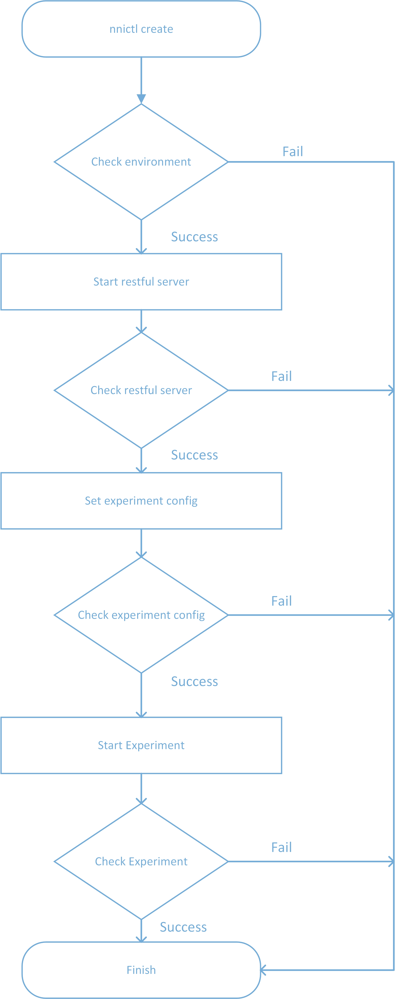

# 如何启动实验

## 1. 简介

There are few steps to start an new experiment of nni, here are the process.

## 2. 详细说明

### 2.1 检查环境

1. 检查是否有旧的实验正在运行。 
2. 检查 RESTful 服务端口是否可用。 
3. 验证 yaml 配置文件的内容。 
4. 准备配置文件来记录实验信息。 

### 2.2 启动 RESTful 服务

启动 RESTful 服务进程来管理 NNI 实验，默认端口为 8080。

### 2.3 检查 RESTful 服务

检查是否 RESTful 服务进程成功启动，发送到 RESTful 服务的消息是否正常返回。

### 2.4 设置实验配置

在启动实验前调用 RESTful 服务来设置实验配置，包括 yaml 配置文件中的值。

### 2.5 检查实验配置

Check the response content of restful server, if the status code of response is 200, the config is successfully set.

### 2.6 启动实验

调用 RESTful 服务进程来设置实验。

### 2.7 检查实验

1. 检查 RESTful 服务的返回值。
2. 处理错误信息。
3. 输出成功或失败信息。
4. 保存配置信息到 nnictl 的配置文件。