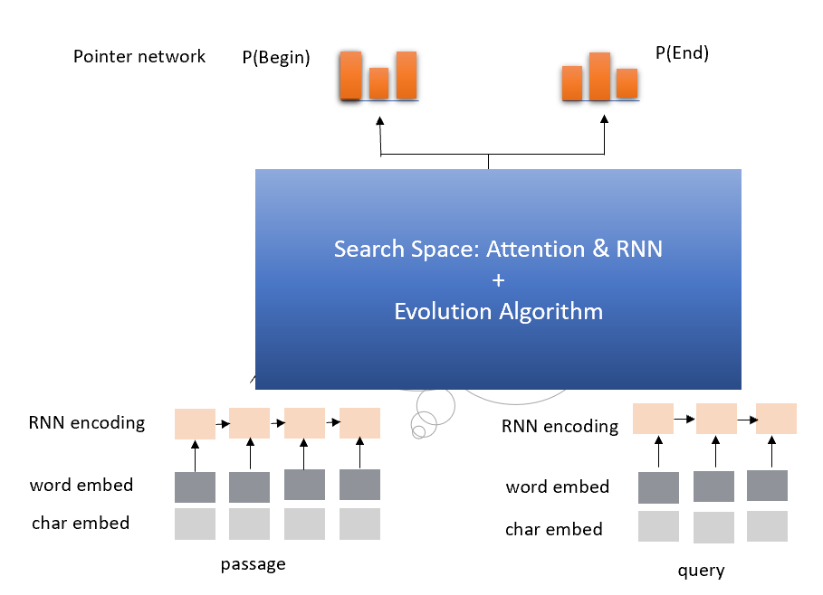

# 在阅读理解上使用自动模型架构搜索

该样例展示了如何使用遗传算法为阅读理解任务找到好的模型架构。

## 搜索空间

对于阅读理解项目，注意力和循环神经网络（RNN）模块已经被证明非常有效。 使用的搜索空间如下：

1. IDENTITY (Effectively 表示继续训练)。
2. INSERT-RNN-LAYER (插入 LSTM。 在实验中比较了 GRU 和 LSTM 的性能后，我们决定在这里采用 LSTM。)
3. REMOVE-RNN-LAYER
4. INSERT-ATTENTION-LAYER (插入注意力层。)
5. REMOVE-ATTENTION-LAYER
6. ADD-SKIP (在随机层之间一致).
7. REMOVE-SKIP (移除随机跳过).



## 新版本

另一个时间更快，性能更好的版本正在开发中。 很快将发布。

# 如何运行此样例？

## 在本机或远程上运行此样例

### 使用下载脚本来下载数据

执行下列命令来下载所需要的数据：

    chmod +x ./download.sh
    ./download.sh
    

### 手动下载

1. 在 https://rajpurkar.github.io/SQuAD-explorer/ 下载 "dev-v1.1.json" 和 "train-v1.1.json"。
    
    ```bash
    wget https://rajpurkar.github.io/SQuAD-explorer/dataset/train-v1.1.json
    wget https://rajpurkar.github.io/SQuAD-explorer/dataset/dev-v1.1.json
    ```

2. 在 https://nlp.stanford.edu/projects/glove/ 下载 "glove.840B.300d.txt"。
    
    ```bash
    wget http://nlp.stanford.edu/data/glove.840B.300d.zip
    unzip glove.840B.300d.zip
    ```

### 更新配置

修改 `nni/examples/trials/ga_squad/config.yml`，以下是默认配置：

    authorName: default
    experimentName: example_ga_squad
    trialConcurrency: 1
    maxExecDuration: 1h
    maxTrialNum: 1
    #可选项: local, remote
    trainingServicePlatform: local
    #可选项: true, false
    useAnnotation: false
    tuner:
      codeDir: ~/nni/examples/tuners/ga_customer_tuner
      classFileName: customer_tuner.py
      className: CustomerTuner
      classArgs:
        optimize_mode: maximize
    trial:
      command: python3 trial.py
      codeDir: ~/nni/examples/trials/ga_squad
      gpuNum: 0
    

在 "trial" 部分中，如果需要使用 GPU 来进行架构搜索，可将 `gpuNum` 从 `0` 改为 `1`。 根据训练时长，可以增加 `maxTrialNum` 和 `maxExecDuration`。

`trialConcurrency` 是并发运行的尝试的数量。如果将 `gpuNum` 设置为 1，则需要与 GPU 数量一致。

### 提交任务

    nnictl create --config ~/nni/examples/trials/ga_squad/config.yml
    

## 在 OpenPAI 上运行此样例

根据上传大小的限制，仅上传源代码，并在训练过程中下载数据。 本实验需要的内存 `memoryMB >= 32G`，训练过程可能需要数小时。

### 更新配置

修改 `nni/examples/trials/ga_squad/config_pai.yaml`，以下是默认配置：

    authorName: default
    experimentName: example_ga_squad
    trialConcurrency: 1
    maxExecDuration: 1h
    maxTrialNum: 10
    #可选项: local, remote, pai
    trainingServicePlatform: pai
    #可选项: true, false
    useAnnotation: false
    # nni_manager 的 ip
    nniManagerIp: 10.10.10.10
    tuner:
      codeDir: ../../tuners/ga_customer_tuner
      classFileName: customer_tuner.py
      className: CustomerTuner
      classArgs:
        optimize_mode: maximize
    trial:
      command: chmod +x ./download.sh && ./download.sh && python3 trial.py
      codeDir: .
      gpuNum: 0
      cpuNum: 1
      memoryMB: 32869
      #在 OpenPAI 上运行 NNI 任务的 Docker 映像
      image: msranni/nni:latest
      #在 OpenPAI 的 hdfs 目录上存储数据的目录，如：'hdfs://host:port/directory'
      dataDir: hdfs://10.10.10.10:9000/username/nni
      #在 OpenPAI 的 hdfs 目录上存储输出的目录，如：'hdfs://host:port/directory'
      outputDir: hdfs://10.10.10.10:9000/username/nni
    paiConfig:
      #登录 OpenPAI 的用户名
      userName: username
      #登录 OpenPAI 的密码
      passWord: password
      # OpenPAI 的 RESTful 服务器地址
      host: 10.10.10.10
    

将默认值改为个人账户和服务器信息。 包括 `nniManagerIp`, `dataDir`, `outputDir`, `userName`, `passWord` 和 `host`。

在 "trial" 部分中，如果需要使用 GPU 来进行架构搜索，可将 `gpuNum` 从 `0` 改为 `1`。 根据训练时长，可以增加 `maxTrialNum` 和 `maxExecDuration`。

`trialConcurrency` 是并发运行的尝试的数量。如果将 `gpuNum` 设置为 1，则需要与 GPU 数量一致。

### 提交任务

    nnictl create --config ~/nni/examples/trials/ga_squad/config_pai.yml
    

# 关于此尝试的技术细节

## 实现方法

基于进化算法架构的问答和其它样例一样，有两个部分：尝试和调参器。

### 尝试

尝试有大量的文件、函数和类。 这里只简单介绍最重要的文件：

* `attention.py` 包含了 Tensorflow 注意力算法的实现。
* `data.py` 包含了数据处理函数。
* `evaluate.py` 包含了评估脚本。
* `graph.py` 包含了计算图的定义。
* `rnn.py` 包含了 TensorFlow 的 GRU 实现。
* `train_model.py` 是整个文档模型的封装。

这些文件中，`trial.py` 和 `graph_to_tf.py` 非常特别。

`graph_to_tf.py` 有一个叫做 `graph_to_network`的函数，其框架代码如下：

    def graph_to_network(input1,
                         input2,
                         input1_lengths,
                         input2_lengths,
                         graph,
                         dropout_rate,
                         is_training,
                         num_heads=1,
                         rnn_units=256):
        topology = graph.is_topology()
        layers = dict()
        layers_sequence_lengths = dict()
        num_units = input1.get_shape().as_list()[-1]
        layers[0] = input1*tf.sqrt(tf.cast(num_units, tf.float32)) + \
            positional_encoding(input1, scale=False, zero_pad=False)
        layers[1] = input2*tf.sqrt(tf.cast(num_units, tf.float32))
        layers[0] = dropout(layers[0], dropout_rate, is_training)
        layers[1] = dropout(layers[1], dropout_rate, is_training)
        layers_sequence_lengths[0] = input1_lengths
        layers_sequence_lengths[1] = input2_lengths
        for _, topo_i in enumerate(topology):
            if topo_i == '|':
                continue
            if graph.layers[topo_i].graph_type == LayerType.input.value:
                # ......
            elif graph.layers[topo_i].graph_type == LayerType.attention.value:
                # ......
            # 处理更多层
    

正如我们看到的，这个函数实际上是个编译器。它将内部模型的 DAG 配置`图`（在`模型配置格式`章节介绍）转换为 Tensorflow 的计算图。

    topology = graph.is_topology()
    

将内部图表示进行拓扑排序，代码在下列循环中：

    for _, topo_i in enumerate(topology):
    

执行实际转换，将每层映射为 TensorFlow 计算图中的一部分。

### 调参器

调参器比尝试代码简单很多。 它们共用了同样的 `graph.py`。 此外，调参器有 `customer_tuner.py`，其中最重要的类是 `CustomerTuner`：

    class CustomerTuner(Tuner):
        # ......
    
        def generate_parameters(self, parameter_id):
            """将一组尝试图配置作为序列化对象返回。
            parameter_id : int
            """
            if len(self.population) <= 0:
                logger.debug("the len of poplution lower than zero.")
                raise Exception('The population is empty')
            pos = -1
            for i in range(len(self.population)):
                if self.population[i].result == None:
                    pos = i
                    break
            if pos != -1:
                indiv = copy.deepcopy(self.population[pos])
                self.population.pop(pos)
                temp = json.loads(graph_dumps(indiv.config))
            else:
                random.shuffle(self.population)
                if self.population[0].result > self.population[1].result:
                    self.population[0] = self.population[1]
                indiv = copy.deepcopy(self.population[0])
                self.population.pop(1)
                indiv.mutation()
                graph = indiv.config
                temp =  json.loads(graph_dumps(graph))
    
        # ......
    

重载函数 `generate_parameters` 实现了简单的变异算法。 代码如下：

                if self.population[0].result > self.population[1].result:
                    self.population[0] = self.population[1]
                indiv = copy.deepcopy(self.population[0])
    

控制突变过程。 It will always take two random individuals in the population, only keeping and mutating the one with better result.

## Model configuration format

Here is an example of the model configuration, which is passed from the tuner to the trial in the architecture search procedure.

    {
        "max_layer_num": 50,
        "layers": [
            {
                "input_size": 0,
                "type": 3,
                "output_size": 1,
                "input": [],
                "size": "x",
                "output": [4, 5],
                "is_delete": false
            },
            {
                "input_size": 0,
                "type": 3,
                "output_size": 1,
                "input": [],
                "size": "y",
                "output": [4, 5],
                "is_delete": false
            },
            {
                "input_size": 1,
                "type": 4,
                "output_size": 0,
                "input": [6],
                "size": "x",
                "output": [],
                "is_delete": false
            },
            {
                "input_size": 1,
                "type": 4,
                "output_size": 0,
                "input": [5],
                "size": "y",
                "output": [],
                "is_delete": false
            },
            {"Comment": "More layers will be here for actual graphs."}
        ]
    }
    

Every model configuration will has a "layers" section, which is a JSON list of layer definitions. The definition of each layer is also a JSON object, where:

* `type` is the type of the layer. 0, 1, 2, 3, 4 correspond to attention, self-attention, RNN, input and output layer respectively.
* `size` is the length of the output. "x", "y" correspond to document length / question length, respectively.
* `input_size` is the number of inputs the layer has.
* `input` is the indices of layers taken as input of this layer.
* `output` is the indices of layers use this layer's output as their input.
* `is_delete` means whether the layer is still available.