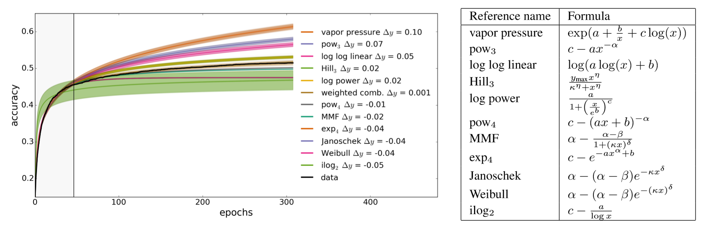
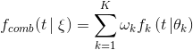
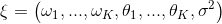
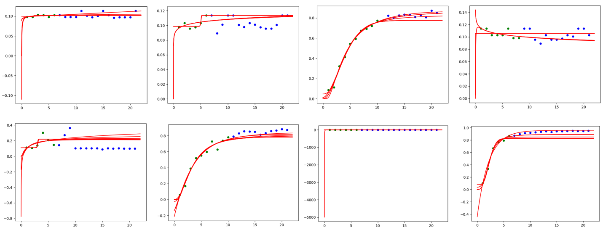

# NNI 中的 Curve Fitting 评估器

## 1. 介绍

Curve Fitting 评估器是一个 LPA (learning, predicting, assessing，即学习、预测、评估) 的算法。 如果预测的尝试 X 在 step S 比性能最好的尝试要差，就会提前终止它。

此算法中，使用了 12 条曲线来拟合学习曲线，从[参考论文](http://aad.informatik.uni-freiburg.de/papers/15-IJCAI-Extrapolation_of_Learning_Curves.pdf)中选择了大量的参数曲线模型。 学习曲线的形状与先验知识是一致的：都是典型的递增的、饱和的函数。

所有学习曲线模型被合并到了单个，更强大的模型中。 合并的模型通过加权线性混合：

合并后的参数向量

假设增加一个高斯噪声，且噪声参数初始化为最大似然估计。

通过学习历史数据来确定新的组合参数向量的最大概率值。 用这样的方法来预测后面的尝试性能，并停止不好的尝试来节省计算资源。

具体来说，该算法有学习、预测和评估三个阶段。

* Step1: 学习。 从当前尝试的历史中学习，并从贝叶斯角度决定 \xi 。 首先，使用最小二乘法 (由 `fit_theta` 实现) 来节省时间。 获得参数后，过滤曲线并移除异常点（由 `filter_curve` 实现）。 最后，使用 MCMC 采样方法 (由 `mcmc_sampling` 实现) 来调整每个曲线的权重。 至此，确定了 \xi 中的所有参数。
* 步骤 2: 预测。 Calculates the expected final result accuracy(implement by `f_comb`) at target position(ie the total number of epoch) by the \xi and the formula of the combined model.
* Step3: If the fitting result doesn't converge, the predicted value will be `None`, in this case we return `AssessResult.Good` to ask for future accuracy information and predict again. Furthermore, we will get a positive value by `predict()` function, if this value is strictly greater than the best final performance in history * `THRESHOLD`(default value = 0.95), return `AssessResult.Good`, otherwise, return `AssessResult.Bad`

The figure below is the result of our algorithm on MNIST trial history data, where the green point represents the data obtained by Assessor, the blue point represents the future but unknown data, and the red line is the Curve predicted by the Curve fitting assessor.

## 2. Usage

To use Curve Fitting Assessor, you should add the following spec in your experiment's yaml config file:

    assessor:
        builtinAssessorName: Curvefitting
        classArgs:
          # (required)The total number of epoch.
          # We need to know the number of epoch to determine which point we need to predict.
          epoch_num: 20
          # (optional) choice: maximize, minimize
          * The default value of optimize_mode is maximize
          optimize_mode: maximize
          # Kindly reminds that if you choose minimize mode, please adjust the value of threshold >= 1.0 (e.g threshold=1.1)
          # (optional) A trial is determined to be stopped or not
          # In order to save our computing resource, we start to predict when we have more than start_step(default=6) accuracy points.
          # only after receiving start_step number of reported intermediate results.
          * The default value of start_step is 6.
          start_step: 6
          # (optional) The threshold that we decide to early stop the worse performance curve.
          # For example: if threshold = 0.95, optimize_mode = maximize, best performance in the history is 0.9, then we will stop the trial which predict value is lower than 0.95 * 0.9 = 0.855.
          * The default value of threshold is 0.95.
          threshold: 0.95
    

## 3. File Structure

The assessor has a lot of different files, functions and classes. Here we will only give most of those files a brief introduction:

* `curvefunctions.py` includes all the function expression and default parameters.
* `modelfactory.py` includes learning and predicting, the corresponding calculation part is also implemented here.
* `curvefitting_assessor.py` is a assessor which receives the trial history and assess whether to early stop the trial.

## 4. TODO

* Further improve the accuracy of the prediction and test it on more models.